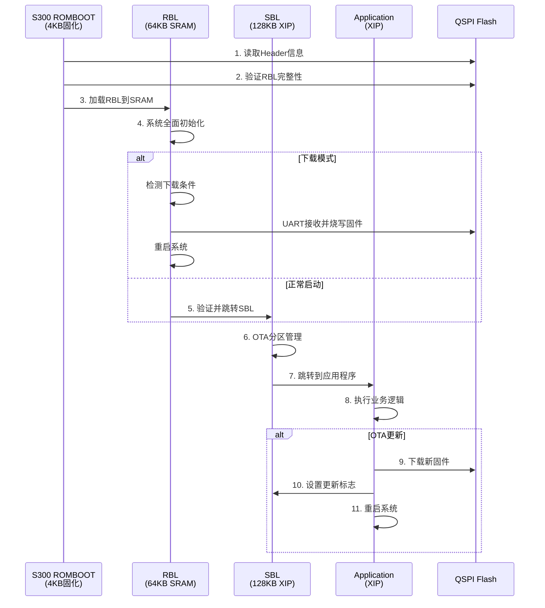

# S300 BSP架构设计文档

## 文档版本控制

| 版本 | 日期       | 作者         | 修订说明                                    |
| ---- | ---------- | ------------ | ------------------------------------------- |
| 2.0  | 2025-08-30 | AI Assistant | 整合所有BSP架构文档，删除重复内容，完善设计 |

---

## 1. 设计概述

### 1.1 设计目标

S300 BSP（Board Support Package）遵循CMSIS标准，为S300芯片提供完整的硬件抽象层和开发支持。设计目标包括：

- **CMSIS兼容**: 遵循ARM CMSIS标准，提供标准化的设备支持
- **分层清晰**: Core/Device → Drivers → Boards → Projects，职责明确
- **ESP32兼容**: 开发体验和API接口尽量与ESP32保持一致
- **可扩展性**: 支持多种板型配置和外设扩展
- **高性能**: 充分利用S300硬件特性，优化启动和运行性能

### 1.2 芯片资源概览

**S300 (PiMCHIP)芯片规格**:
- **CPU**: ARM Cortex-M4 @ 200MHz, FPU, DSP指令集
- **内存**: 
  - SRAM0: 8KB (0x10000000 - 0x10002000) - 特殊用途
  - SRAM1: 384KB (0x20000000 - 0x20060000) - 主要运行区域
- **存储**: 
  - 内置Flash: 4KB ROMBOOT (固化)
  - 外部QSPI Flash: 16MB W25Q128, 支持XIP模式
  - 外部SD卡: 可选，用于数据存储
- **外设**: UART×4, SPI×3, I2C×2, TIMER×8, DMA, GPIO, ADC, DAC等

---

## 2. BSP目录架构

### 2.1 总体目录结构

```
S300_BSP/
├── CMSIS/                           # ARM CMSIS标准支持
│   ├── Core/Include/                # CMSIS Core头文件 (ARM官方)
│   └── Device/PiMCHIP/S300/        # S300设备支持包
│       ├── Include/
│       │   ├── s300.h              # 主设备头文件
│       │   ├── system_s300.h       # 系统配置
│       │   └── s300_regs.h         # 寄存器定义
│       └── Source/
│           ├── system_s300.c       # 系统初始化
│           ├── startup_s300.s      # 启动汇编代码
│           └── s300_vectors.c      # 中断向量表
├── Drivers/                         # 硬件驱动层
│   ├── SoC/                        # 片上系统驱动
│   │   ├── RCC/                    # 复位时钟控制
│   │   ├── GPIO/                   # GPIO驱动
│   │   ├── UART/                   # 串口驱动
│   │   ├── QSPI/                   # QSPI Flash驱动
│   │   ├── DMA/                    # DMA驱动
│   │   ├── I2C/                    # I2C驱动
│   │   ├── SPI/                    # SPI驱动
│   │   └── TIMER/                  # 定时器驱动
│   └── External/                   # 外部器件驱动
│       ├── W25Qxx/                 # W25Q系列Flash驱动
│       ├── OV5640/                 # OV5640摄像头驱动
│       └── WM8978/                 # WM8978音频编解码器
├── Boards/                          # 板级支持包
│   └── generic_evb/                # 通用评估板
│       ├── board.h                 # 板级配置定义
│       ├── board.c                 # 板级初始化
│       ├── retarget.c             # 重定向支持
│       └── syscalls.c             # 系统调用实现
├── Projects/                        # 项目和示例
│   ├── RBL/                        # ROM Bootloader项目
│   ├── SBL/                        # Secondary Bootloader项目
│   ├── HelloWorld/                 # Hello World示例
│   ├── Demo/                       # 各种演示项目
│   └── App_YmodemOTA/             # YMODEM OTA应用
├── ld/                             # 链接脚本
│   ├── rbl.ld                     # RBL链接脚本
│   └── sram.ld                    # SRAM链接脚本
└── docs/                           # 文档目录
    ├── S300_BSP_Architecture.md   # 本文档
    ├── S300_Boot_Architecture.md  # 启动架构文档
    ├── coding_style_cn.md         # 编码规范(中文)
    └── coding_style_en.md         # 编码规范(英文)
```

### 2.2 层次化设计原则

**Layer 1: CMSIS Core**
- ARM标准CMSIS Core接口
- 处理器核心抽象和中断管理
- 标准化的系统控制接口

**Layer 2: Device Layer**
- S300芯片特定的寄存器定义
- 系统初始化和时钟配置
- 中断向量表和异常处理

**Layer 3: Driver Layer**
- 片上外设的底层驱动
- 外部器件的设备驱动
- 统一的HAL接口设计

**Layer 4: Board Layer**
- 特定板型的配置和初始化
- 引脚映射和外设路由
- 板级功能抽象

**Layer 5: Application Layer**
- 示例程序和演示项目
- 完整的应用解决方案
- 启动引导程序

---

## 3. 启动架构设计

### 3.1 四级启动流程

S300采用四级启动架构，形成完整的信任链：



### 3.2 各级功能定义

**Stage 1: ROMBOOT (0-4KB)**
- 芯片固化ROM程序，功能极简
- 最小化CPU和SRAM初始化
- 读取Flash Header并验证RBL
- 加载RBL到SRAM并跳转执行

**Stage 2: RBL (ROM Bootloader)**
- 存储位置: QSPI Flash 0x100-0x10000 (64KB)
- 运行位置: SRAM 0x20000000 
- 主要功能:
  - 完整系统初始化 (时钟、QSPI、UART等)
  - ESP32兼容的启动模式检测
  - UART下载协议支持 (YMODEM)
  - SBL验证和跳转

**Stage 3: SBL (Secondary Bootloader)**
- 存储位置: QSPI Flash 0x10000-0x30000 (128KB)
- 运行模式: QSPI XIP模式
- 主要功能:
  - 分区表管理
  - A/B分区OTA支持
  - 应用镜像验证
  - 故障恢复和回滚

**Stage 4: Application**
- 存储位置: QSPI Flash 0x40000+ (多分区)
- 运行模式: QSPI XIP模式
- 功能: 用户业务逻辑实现

### 3.3 内存映射规划

**Flash分区布局** (16MB W25Q128):
```
0x00000000 +-------------+ QSPI Flash起始
           | Header(256B) | RBL元信息
0x00000100 +-------------+
           | RBL (64KB)   | ROM Bootloader  
0x00010000 +-------------+
           | SBL (128KB)  | Secondary Bootloader
0x00030000 +-------------+
           | NVS (64KB)   | 配置存储区
0x00040000 +-------------+
           | OTA_0(6MB)   | 应用分区A
0x00640000 +-------------+
           | OTA_1(6MB)   | 应用分区B
0x00C40000 +-------------+
           | Data(3.75MB) | 用户数据区
0x01000000 +-------------+ Flash结束
```

**SRAM映射**:
```
0x10000000 +-------------+ SRAM0起始 (8KB)
           | 备用/特殊    |
0x10002000 +-------------+ SRAM0结束
0x20000000 +-------------+ SRAM1起始 (384KB)
           | RBL代码区    | RBL运行空间
0x20010000 +-------------+
           | 堆栈区       | 系统堆栈
0x20020000 +-------------+
           | 应用数据     | 应用程序数据
0x20060000 +-------------+ SRAM1结束
```

**QSPI XIP映射**:
```
0x80000000 +-------------+ XIP基地址
           | 映射整个Flash | 16MB直接访问
0x81000000 +-------------+ XIP结束
```

---

## 4. 驱动架构设计

### 4.1 SoC驱动设计

所有片上外设驱动遵循统一的设计模式：

**标准头文件结构** (`s300_<peripheral>.h`):
```c
#ifndef S300_<PERIPHERAL>_H
#define S300_<PERIPHERAL>_H

#include "s300.h"

/* 配置结构体 */
typedef struct {
    uint32_t parameter1;
    uint32_t parameter2;
    // ...
} s300_<peripheral>_config_t;

/* 句柄结构体 */
typedef struct {
    <PERIPHERAL>_TypeDef *instance;
    s300_<peripheral>_config_t config;
    uint8_t state;
} s300_<peripheral>_handle_t;

/* API函数声明 */
int s300_<peripheral>_init(s300_<peripheral>_handle_t *handle);
int s300_<peripheral>_deinit(s300_<peripheral>_handle_t *handle);
// 具体功能API...

#endif /* S300_<PERIPHERAL>_H */
```

### 4.2 外设驱动示例

**RCC (复位时钟控制)驱动**:
```c
// s300_rcc.h - 时钟管理
typedef enum {
    S300_RCC_SYSCLK_HSI = 0,    // 内部高速时钟
    S300_RCC_SYSCLK_HSE,        // 外部高速时钟  
    S300_RCC_SYSCLK_PLL,        // PLL时钟
} s300_rcc_sysclk_src_t;

int s300_rcc_config_sysclk(s300_rcc_sysclk_src_t src, uint32_t freq);
uint32_t s300_rcc_get_sysclk_freq(void);
int s300_rcc_enable_peripheral(uint32_t peripheral);
```

**GPIO驱动**:
```c
// s300_gpio.h - GPIO管理
typedef enum {
    S300_GPIO_MODE_INPUT = 0,
    S300_GPIO_MODE_OUTPUT,
    S300_GPIO_MODE_AF,           // 复用功能
    S300_GPIO_MODE_ANALOG,       // 模拟功能
} s300_gpio_mode_t;

int s300_gpio_config_pin(GPIO_TypeDef *port, uint16_t pin, s300_gpio_mode_t mode);
int s300_gpio_write_pin(GPIO_TypeDef *port, uint16_t pin, uint8_t value);
uint8_t s300_gpio_read_pin(GPIO_TypeDef *port, uint16_t pin);
```

**UART驱动**:
```c
// s300_uart.h - 串口管理
typedef struct {
    uint32_t baudrate;
    uint8_t word_length;
    uint8_t stop_bits;
    uint8_t parity;
    uint8_t flow_control;
} s300_uart_config_t;

int s300_uart_init(UART_TypeDef *uart, const s300_uart_config_t *config);
int s300_uart_transmit(UART_TypeDef *uart, const uint8_t *data, uint16_t size);
int s300_uart_receive(UART_TypeDef *uart, uint8_t *data, uint16_t size);
```

### 4.3 错误处理和状态管理

**统一错误码定义**:
```c
// s300_error.h
typedef enum {
    S300_OK = 0,
    S300_ERROR = -1,
    S300_ERROR_INVALID_PARAM = -2,
    S300_ERROR_TIMEOUT = -3,
    S300_ERROR_BUSY = -4,
    S300_ERROR_NOT_SUPPORTED = -5,
    // 各外设特定错误码...
} s300_status_t;
```

**驱动状态定义**:
```c
typedef enum {
    S300_STATE_RESET = 0,
    S300_STATE_READY,
    S300_STATE_BUSY,
    S300_STATE_ERROR,
} s300_state_t;
```

---

## 5. 板级支持设计

### 5.1 板级配置抽象

每个板型都有独立的配置目录，包含：

**board.h - 板级引脚定义**:
```c
#ifndef BOARD_H
#define BOARD_H

/* 调试串口配置 */
#define BOARD_DEBUG_UART            UART3
#define BOARD_DEBUG_UART_TX_PIN     GPIO_PIN_10
#define BOARD_DEBUG_UART_RX_PIN     GPIO_PIN_11
#define BOARD_DEBUG_UART_PORT       GPIOB

/* LED配置 */
#define BOARD_LED1_PIN              GPIO_PIN_13
#define BOARD_LED1_PORT             GPIOC

/* 按键配置 */
#define BOARD_KEY1_PIN              GPIO_PIN_0
#define BOARD_KEY1_PORT             GPIOA

/* QSPI Flash配置 */
#define BOARD_QSPI_CLK_PIN          GPIO_PIN_2
#define BOARD_QSPI_CLK_PORT         GPIOB
// ... 其他QSPI引脚

/* 板级时钟配置 */
#define BOARD_HSE_FREQ              25000000    // 25MHz外部晶振
#define BOARD_SYSCLK_FREQ           200000000   // 200MHz系统时钟

#endif /* BOARD_H */
```

**board.c - 板级初始化实现**:
```c
#include "board.h"
#include "s300_rcc.h"
#include "s300_gpio.h"
#include "s300_uart.h"

int board_early_init(void)
{
    /* 基础时钟配置 */
    s300_rcc_config_sysclk(S300_RCC_SYSCLK_HSE, BOARD_SYSCLK_FREQ);
    
    /* GPIO端口时钟使能 */
    s300_rcc_enable_peripheral(RCC_AHB1_GPIOA);
    s300_rcc_enable_peripheral(RCC_AHB1_GPIOB);
    s300_rcc_enable_peripheral(RCC_AHB1_GPIOC);
    
    return 0;
}

int board_init(void)
{
    /* LED初始化 */
    s300_gpio_config_pin(BOARD_LED1_PORT, BOARD_LED1_PIN, S300_GPIO_MODE_OUTPUT);
    
    /* 调试串口初始化 */
    s300_uart_config_t uart_config = {
        .baudrate = 115200,
        .word_length = 8,
        .stop_bits = 1,
        .parity = 0,
        .flow_control = 0
    };
    s300_uart_init(BOARD_DEBUG_UART, &uart_config);
    
    return 0;
}
```

### 5.2 多板型支持

通过编译时宏定义选择不同板型：

```makefile
# Makefile中的板型选择
BOARD ?= generic_evb

# 根据板型设置包含路径
BOARD_DIR = Boards/$(BOARD)
INCLUDES += -I$(BOARD_DIR)

# 编译时定义板型宏
CFLAGS += -DBOARD_$(shell echo $(BOARD) | tr a-z A-Z)
```

---

## 6. 项目构建系统

### 6.1 GCC构建配置

**主Makefile结构**:
```makefile
# S300 BSP主Makefile
PROJECT_NAME = S300_BSP
BOARD ?= generic_evb
BUILD_TYPE ?= Release

# 工具链配置
PREFIX = arm-none-eabi-
CC = $(PREFIX)gcc
AS = $(PREFIX)as
LD = $(PREFIX)ld
OBJCOPY = $(PREFIX)objcopy
OBJDUMP = $(PREFIX)objdump
SIZE = $(PREFIX)size

# 编译选项
CFLAGS = -mcpu=cortex-m4 -mthumb -mfloat-abi=hard -mfpu=fpv4-sp-d16
CFLAGS += -ffunction-sections -fdata-sections
CFLAGS += -Wall -Wextra -O2 -g3

# 包含路径
INCLUDES = -ICMSIS/Core/Include
INCLUDES += -ICMSIS/Device/PiMCHIP/S300/Include
INCLUDES += -IDrivers/SoC/RCC/Include
INCLUDES += -IDrivers/SoC/GPIO/Include
INCLUDES += -IBoards/$(BOARD)

# 源文件路径
SOURCES = CMSIS/Device/PiMCHIP/S300/Source/system_s300.c
SOURCES += CMSIS/Device/PiMCHIP/S300/Source/startup_s300.s
SOURCES += Drivers/SoC/RCC/Source/s300_rcc.c
SOURCES += Drivers/SoC/GPIO/Source/s300_gpio.c
SOURCES += Boards/$(BOARD)/board.c

# 链接脚本
LDSCRIPT = ld/sram.ld

# 构建目标
all: $(PROJECT_NAME).elf $(PROJECT_NAME).bin $(PROJECT_NAME).hex

include common.mk
```

### 6.2 项目模板

**标准项目结构**:
```
Project_Template/
├── GCC/
│   ├── Makefile              # 项目专用构建配置
│   └── .gitignore           # 忽略构建产物
├── Inc/
│   └── main.h               # 项目头文件
├── Src/
│   └── main.c               # 项目源文件
└── README.md                # 项目说明
```

**项目模板main.c**:
```c
#include "main.h"
#include "board.h"
#include "s300_rcc.h"
#include "s300_gpio.h"
#include "s300_uart.h"

int main(void)
{
    /* 板级初始化 */
    board_early_init();
    board_init();
    
    printf("S300 Project Template Started!\r\n");
    
    while (1) {
        /* 主循环 */
        board_led_toggle();
        s300_delay_ms(1000);
    }
}
```

---

## 7. 开发工具和调试

### 7.1 开发工具链

**推荐工具链**:
- **编译器**: ARM GCC 10.3-2021.10 或更新版本
- **调试器**: OpenOCD + GDB
- **IDE**: VS Code + ARM插件 或 Keil MDK
- **下载工具**: 自研s300_idf.sh脚本

**OpenOCD配置** (s300.cfg):
```tcl
# S300芯片OpenOCD配置
source [find interface/stlink-v2.cfg]
source [find target/stm32f4x.cfg]  # 使用类似配置

# S300特定配置
set CHIPNAME s300
set CPUTAPID 0x4ba00477

# Flash配置
flash bank $_FLASHNAME stm32f2x 0x08000000 0 0 0 $_TARGETNAME
flash bank qspi_flash stmsmi 0x80000000 0x1000000 0 0 $_TARGETNAME 0x40007000
```

### 7.2 调试支持

**UART调试输出**:
```c
// retarget.c - printf重定向到UART
int _write(int file, char *ptr, int len)
{
    for (int i = 0; i < len; i++) {
        s300_uart_transmit_byte(BOARD_DEBUG_UART, ptr[i]);
    }
    return len;
}
```

**断言和错误处理**:
```c
// s300_assert.h
#ifdef DEBUG
#define S300_ASSERT(expr) \
    do { \
        if (!(expr)) { \
            printf("Assert failed: %s, file %s, line %d\r\n", \
                   #expr, __FILE__, __LINE__); \
            while(1); \
        } \
    } while(0)
#else
#define S300_ASSERT(expr) ((void)0)
#endif
```

---

## 8. 性能优化策略

### 8.1 启动时间优化

- **QSPI XIP模式**: SBL和APP直接从Flash执行，减少加载时间
- **分阶段初始化**: 只初始化必要的外设，延迟非关键模块
- **代码优化**: 使用-O2优化，启用函数和数据段分离

### 8.2 内存使用优化

- **堆栈大小调优**: 根据实际需求配置合理的堆栈大小
- **静态内存分配**: 关键代码使用静态分配，避免动态分配开销
- **代码位置优化**: 将频繁访问的代码放置在SRAM中执行

### 8.3 功耗优化

- **时钟管理**: 运行时动态调整时钟频率
- **外设控制**: 不使用的外设及时关闭时钟
- **低功耗模式**: 支持睡眠和深度睡眠模式

---

## 9. 质量保证

### 9.1 代码规范

遵循统一的编码规范（详见coding_style_cn.md）：
- 命名规范：小写+下划线风格
- 文件组织：头文件包含保护，源文件结构统一
- 注释要求：函数和重要逻辑都有详细注释
- 代码格式：使用clang-format自动格式化

### 9.2 测试策略

**单元测试**:
- 每个驱动模块都有对应的测试用例
- 使用模拟硬件进行驱动层测试
- 自动化测试脚本验证功能正确性

**集成测试**:
- 完整的启动流程测试
- 多外设协同工作测试
- 长时间稳定性测试

### 9.3 文档维护

- **API文档**: 使用Doxygen生成API参考文档
- **设计文档**: 及时更新架构和设计文档
- **示例代码**: 为每个功能提供示例代码

---

## 10. 版本管理和发布

### 10.1 版本号规则

采用语义化版本号 (SemVer)：
- **主版本号**: 不兼容的API修改
- **次版本号**: 向下兼容的功能性新增
- **修订版本号**: 向下兼容的问题修正

### 10.2 发布流程

1. **开发分支**: feature/xxx 开发新功能
2. **测试分支**: develop 集成测试
3. **发布分支**: release/vx.x.x 发布准备
4. **主分支**: main 稳定发布版本
5. **标签管理**: git tag 标记发布版本

---

## 11. 总结

S300 BSP架构设计实现了以下目标：

✅ **标准化**: 遵循ARM CMSIS标准，提供标准化的开发接口
✅ **模块化**: 清晰的分层设计，各层职责明确，便于维护和扩展  
✅ **高性能**: 充分利用S300硬件特性，优化启动和运行性能
✅ **易用性**: ESP32兼容的开发体验，降低学习成本
✅ **可靠性**: 完善的错误处理和测试策略，确保系统稳定性

本架构为S300芯片提供了完整的BSP解决方案，支持从简单的Hello World到复杂的OTA系统等各种应用场景。通过统一的接口设计和规范化的开发流程，能够有效提升开发效率和代码质量。

### 相关文档

- [S300启动架构设计](S300_Boot_Architecture.md)
- [编码规范(中文)](coding_style_cn.md)
- [编码规范(英文)](coding_style_en.md)
- [RBL项目文档](../Projects/RBL/README.md)
- [SBL项目文档](../Projects/SBL/README.md)
