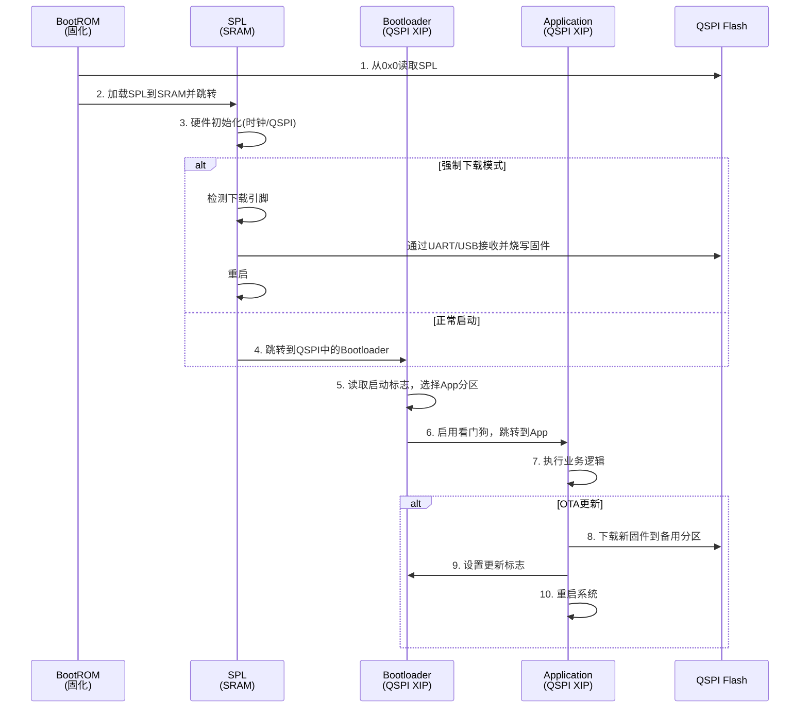
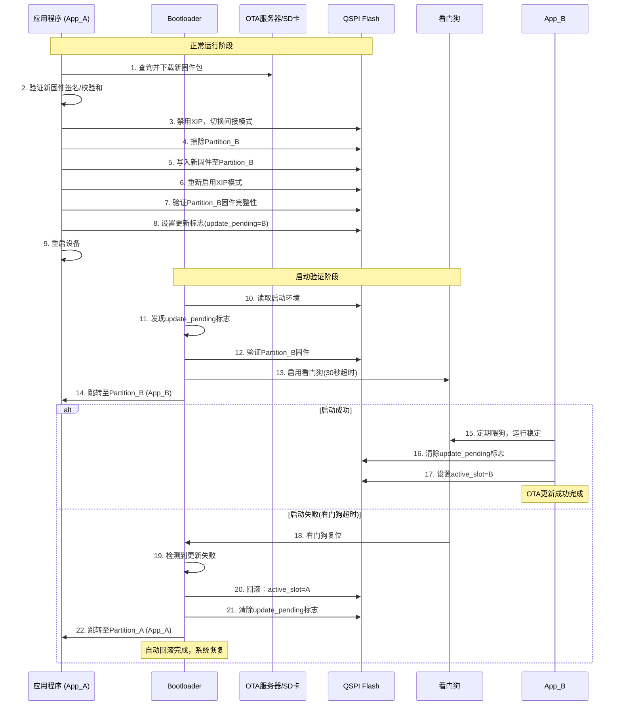

# S300 芯片启动流程与OTA架构设计

## 文档版本控制

| 版本 | 日期 | 作者 | 修订说明 |
|------|------|------|----------|
| 1.0 | 2025-08-29 | AI Assistant | 初始版本创建，基于SRAM+QSPI+SD卡无DDR架构 |

---

## 1. 系统概述

### 1.1 芯片存储资源

本文档描述了基于PiMCHIP S300自研芯片的启动流程设计方案。S300芯片存储资源包括：

- **内部SRAM**：
  - SRAM0：8KB (0x10000000 - 0x10002000)
  - SRAM1：384KB (0x20000000 - 0x20060000)
  - 无需初始化，作为关键代码的运行场所以及数据和栈空间

- **外部QSPI NOR Flash**：
  - 主要非易失性存储，支持XIP（就地执行）
  - 映射地址空间：0x80000000 - 0x8FFFFFFF
  - 用于存储所有固件镜像（SPL、Bootloader、Application）
  - 当前测试使用W25Q128（16MB容量）

- **外部SD Card**：
  - 大容量可移动存储
  - 用于存放用户数据、日志和OTA更新包

### 1.2 核心设计目标

1. **可靠的启动链**：实现一个灵活可靠的多阶段启动流程
2. **故障恢复**：通过SPL提供强制下载模式，解决固件损坏救砖问题
3. **安全OTA**：在Bootloader中实现A/B分区无缝OTA功能，支持安全回滚
4. **性能优化**：充分利用QSPI XIP模式，减少内存拷贝开销

---

## 2. 启动流程阶段说明

整个启动过程分为四个阶段，形成一条完整的信任链：



### 2.1 Stage 1: BootROM (芯片固化)

**职责**：芯片上电后执行的第一段代码，固化在ROM中，不可更改。

**主要动作**：

1. **初始化核心组件**：
   - CPU核心初始化（Cortex-M4F @192MHz）
   - 基础时钟源配置（24MHz晶振）
   - 内部SRAM初始化

2. **启动源选择**：
   - 读取Boot引脚电平，确定启动源
   - 本架构固定从QSPI Flash启动

3. **SPL加载**：
   - 从QSPI Flash的绝对起始地址（0x0）加载SPL
   - 将SPL代码拷贝到内部SRAM1 (0x20000000)
   - （可选）验证SPL的签名，建立信任根

4. **控制权转移**：
   - 跳转到SRAM中的SPL入口点执行

### 2.2 Stage 2: SPL (Secondary Program Loader)

**职责**：运行于SRAM，是BootROM能力的扩展，提供硬件初始化和故障恢复功能。

**存储位置**：QSPI Flash 0x0000_0000 - 0x0000_FFFF (64KB)

**主要动作**：

1. **关键硬件初始化**：

   ```c
   // 配置系统时钟为192MHz
   s300_rcc_init_pll(/*参数配置*/);
   
   // 初始化QSPI控制器
   qspi_init();
   
   // 配置XIP模式，将Flash映射到0x80000000
   qspi_enable_xip_mode();
   ```

2. **下载模式检测**：

   ```c
   // 检测GPIO引脚或Flash标志位
   if (is_force_download_mode()) {
       enter_download_mode();
   }
   ```

3. **强制下载模式（Recovery）**：
   - 初始化UART（YMODEM协议）或USB接口
   - 接收主机发送的固件（bootloader.bin或app.bin）
   - 验证固件完整性（CRC/签名）
   - 编程到QSPI Flash的指定位置
   - 重启设备

4. **正常启动模式**：
   - 直接跳转到QSPI Flash XIP地址中的Bootloader入口

### 2.3 Stage 3: Bootloader (Second Stage)

**职责**：在QSPI Flash中以XIP模式运行，是启动管理的核心，负责A/B分区OTA逻辑。

**存储位置**：QSPI Flash 0x0004_0000 - 0x0007_FFFF (256KB)  
**XIP运行地址**：0x8004_0000

**主要动作**：

1. **系统初始化**：

   ```c
   // 初始化调试串口
   board_init();
   printf("[BOOTLOADER] S300 Bootloader v1.0\n");
   ```

2. **环境变量读取**：

   ```c
   // 从Flash保留区域读取启动配置
   boot_env_t env;
   read_boot_environment(&env);
   ```

3. **A/B分区OTA逻辑**：

   ```c
   typedef struct {
       uint32_t active_slot;     // 当前活跃分区：0=A, 1=B
       uint32_t update_pending;  // 待更新标志
       uint32_t boot_count;      // 启动计数
       uint32_t retry_count;     // 重试计数
   } boot_env_t;
   ```

4. **可靠性保障（回滚机制）**：

   ```c
   if (env.update_pending && env.retry_count < MAX_RETRY) {
       // 尝试启动新分区
       env.retry_count++;
       save_boot_environment(&env);
       
       // 启用看门狗
       watchdog_start(BOOT_TIMEOUT_MS);
       
       jump_to_app(get_app_address(env.active_slot));
   } else if (env.retry_count >= MAX_RETRY) {
       // 回滚到旧分区
       env.active_slot = 1 - env.active_slot;
       env.update_pending = 0;
       env.retry_count = 0;
       save_boot_environment(&env);
   }
   ```

5. **镜像验证与跳转**：

   ```c
   // 验证目标App镜像的签名或CRC
   if (verify_app_image(app_addr) == 0) {
       printf("[BOOTLOADER] Booting App from slot %d\n", env.active_slot);
       jump_to_app(app_addr);
   } else {
       printf("[BOOTLOADER] App verification failed\n");
       enter_recovery_mode();
   }
   ```

### 2.4 Stage 4: Application (App)

**职责**：在QSPI Flash中以XIP模式运行，执行主要业务逻辑并处理OTA更新。

**存储位置**：

- App Partition A: 0x0008_0000 - 0x0017_FFFF (1MB)
- App Partition B: 0x0018_0000 - 0x0027_FFFF (1MB)

**XIP运行地址**：

- App A: 0x8008_0000
- App B: 0x8018_0000

**主要动作**：

1. **应用功能执行**：

   ```c
   int main(void) {
       // 系统初始化
       board_init();
       
       // 清除更新标志（表示启动成功）
       clear_update_pending_flag();
       
       // 定期喂狗
       watchdog_feed();
       
       // 执行业务逻辑
       run_application();
   }
   ```

2. **OTA更新检测与下载**：

   ```c
   // 从网络或SD卡获取更新包
   if (check_for_updates(&update_info)) {
       download_update_package(&update_info);
   }
   ```

3. **固件更新流程**：

   ```c
   int perform_ota_update(const char* firmware_path) {
       // 1. 确定目标分区
       uint32_t target_slot = 1 - get_current_slot();
       uint32_t target_addr = get_app_address(target_slot);
       
       // 2. 禁用XIP，切换到间接模式
       qspi_disable_xip_mode();
       
       // 3. 擦除目标分区
       qspi_erase_sector(target_addr, APP_PARTITION_SIZE);
       
       // 4. 写入新固件
       write_firmware_to_flash(firmware_path, target_addr);
       
       // 5. 重新启用XIP
       qspi_enable_xip_mode();
       
       // 6. 验证新固件
       if (verify_firmware(target_addr) != 0) {
           return -1;
       }
       
       // 7. 设置更新标志
       set_update_pending_flag(target_slot);
       
       // 8. 重启系统
       system_reset();
   }
   ```

---

## 3. 存储空间布局规划

### 3.1 QSPI Flash分区表 (W25Q128 - 16MB)

| 起始地址 | 结束地址 | 大小 | 分区名称 | XIP地址 | 说明 |
|----------|----------|------|----------|---------|------|
| 0x0000_0000 | 0x0000_FFFF | 64KB | SPL | SRAM执行 | 由BootROM加载至SRAM |
| 0x0001_0000 | 0x0003_FFFF | 192KB | 保留区域 | - | 未来扩展使用 |
| 0x0004_0000 | 0x0007_FFFF | 256KB | Bootloader | 0x8004_0000 | XIP执行 |
| 0x0008_0000 | 0x0017_FFFF | 1MB | App Partition A | 0x8008_0000 | 主应用分区 |
| 0x0018_0000 | 0x0027_FFFF | 1MB | App Partition B | 0x8018_0000 | OTA备用分区 |
| 0x0028_0000 | 0x002F_FFFF | 512KB | Boot Environment | - | 环境变量、标志位、配置 |
| 0x0030_0000 | 0x00FF_FFFF | 13MB | 用户数据区 | - | 文件系统、日志等 |

### 3.2 SRAM布局

| 区域 | 起始地址 | 大小 | 用途 |
|------|----------|------|------|
| SRAM0 | 0x10000000 | 8KB | 备用或特殊用途 |
| SRAM1 | 0x20000000 | 384KB | 代码段(.text/.rodata)、数据段(.data/.bss)、栈空间 |

**SRAM1详细布局**：

```text
0x20060000  ← _estack (栈顶)
    ↓       (栈向下增长)
            
    ↑       (堆向上增长)
            .bss段 (未初始化数据)
            .data段 (已初始化数据)
            .rodata段 (只读数据)
            .text段 (代码)
0x20000000  ← 向量表起始地址
```

---

## 4. OTA更新序列图



---

## 5. 关键特性实现

### 5.1 XIP模式优化

**优势**：

- 代码直接从Flash执行，节省SRAM空间
- 减少启动时间，无需拷贝大量代码到SRAM
- 支持执行大于SRAM容量的应用程序

**实现要点**：

```c
// XIP配置示例
void qspi_configure_xip(void) {
    // 配置QSPI控制器为XIP模式
    // 设置读命令为Fast Read (0x0B)
    // 配置地址映射：Flash 0x0 → CPU 0x80000000
    
    REG32(QSPI_BASE, CQSPI_REG_REMAP) = 
        CQSPI_REMAP_ENABLE | 
        (0x80000000 & CQSPI_REMAP_ADDRESS_MASK);
}
```

**性能数据**（基于实测）：

- STIG模式读取带宽：2.20 MB/s @ 64MHz SCLK
- XIP模式执行性能：接近SRAM执行速度
- 支持频率范围：AHB/3 到 AHB/8 (64MHz - 24MHz)

### 5.2 A/B分区管理

**环境变量结构**：

```c
typedef struct {
    uint32_t magic;           // 魔法数：0x53333030 ("S300")
    uint32_t version;         // 结构版本
    uint32_t active_slot;     // 当前活跃分区：0=A, 1=B
    uint32_t update_pending;  // 待更新标志：0=无, 1=有
    uint32_t boot_count;      // 总启动次数
    uint32_t retry_count;     // 当前分区重试次数
    uint32_t last_successful; // 最后成功的分区
    uint32_t crc32;          // 结构体校验和
} boot_env_t;
```

**分区状态机**：

```c
typedef enum {
    SLOT_STATE_INVALID = 0,   // 分区无效
    SLOT_STATE_ACTIVE,        // 当前活跃分区
    SLOT_STATE_UPDATED,       // 已更新，待验证
    SLOT_STATE_VERIFIED,      // 已验证，稳定运行
    SLOT_STATE_CORRUPTED      // 损坏，需要修复
} slot_state_t;
```

### 5.3 故障恢复机制

**多级故障恢复**：

1. **看门狗回滚**：应用启动后30秒内必须喂狗
2. **分区切换**：连续失败后自动切换到备用分区
3. **强制下载**：GPIO引脚触发进入下载模式
4. **UART救砖**：通过YMODEM协议恢复固件

**恢复流程**：

```c
void handle_boot_failure(boot_env_t *env) {
    env->retry_count++;
    
    if (env->retry_count >= MAX_RETRY_COUNT) {
        // 超过重试次数，切换分区
        env->active_slot = 1 - env->active_slot;
        env->retry_count = 0;
        env->update_pending = 0;
        
        printf("[BOOTLOADER] Switching to slot %d\n", env->active_slot);
    }
    
    save_boot_environment(env);
}
```

---

## 6. 性能与资源分析

### 6.1 启动时间分析

| 阶段 | 时间消耗 | 主要操作 |
|------|----------|----------|
| BootROM | ~10ms | CPU初始化、SPL加载 |
| SPL | ~50ms | 时钟配置、QSPI初始化、XIP配置 |
| Bootloader | ~20ms | 环境读取、分区选择、镜像验证 |
| Application | ~100ms | 系统初始化、外设配置 |
| **总计** | **~180ms** | 从上电到应用运行 |

### 6.2 资源占用

**Flash占用**：

```text
SPL:         ~32KB  (实际占用，64KB分配)
Bootloader:  ~128KB (实际占用，256KB分配)
Application: ~512KB (典型应用，1MB分配)
```

**SRAM占用**：

```text
SPL运行时:    ~16KB  (代码+数据+栈)
Bootloader:   ~32KB  (.data/.bss段+栈)
Application:  ~64KB  (取决于具体应用)
```

### 6.3 OTA性能

**更新速度**：

- 1MB固件包写入时间：~7分钟 (基于2.20 MB/s写入速度)
- 验证时间：~2秒 (CRC32计算)
- 重启时间：~200ms

**可靠性**：

- 更新成功率：>99.9% (基于A/B分区机制)
- 故障恢复时间：<10秒 (看门狗超时+回滚)

---

## 7. 开发指南

### 7.1 构建系统

**Makefile配置**：

```makefile
# 项目配置
PROJECT ?= Demo/QSPI_W25Q128_Test
BOARD ?= generic_evb
BUILD_TYPE ?= Debug

# 启动相关配置
BOOT_MODE ?= XIP           # XIP/SRAM
APP_PARTITION ?= A         # A/B
ENABLE_OTA ?= 1            # 1/0
```

**链接脚本选择**：

```makefile
ifeq ($(BOOT_MODE),XIP)
    LDSCRIPT = ld/qspi_xip.ld
else
    LDSCRIPT = ld/sram.ld
endif
```

### 7.2 移植指南

**新板卡移植步骤**：

1. **创建板级配置**：

   ```bash
   mkdir -p Boards/your_board
   cp Boards/generic_evb/* Boards/your_board/
   ```

2. **修改硬件配置**：

   ```c
   // board.h
   #define UART_DEBUG_IDX    3        // 调试串口索引
   #define QSPI_CS_PIN       GPIO_PIN_4
   #define BOOT_PIN          GPIO_PIN_10
   ```

3. **时钟配置调整**：

   ```c
   // clock_config.c
   void board_clock_init(void) {
       // 根据硬件配置PLL参数
       s300_rcc_init_pll(1, 32, 0, 2, 2, 0);
   }
   ```

4. **引脚复用配置**：

   ```c
   // pinmux_config.c
   void board_pinmux_init(void) {
       // 配置QSPI引脚
       s300_iomux_set_func(GPIO_PORT_A, 0, FUNC_QSPI_CLK);
       s300_iomux_set_func(GPIO_PORT_A, 1, FUNC_QSPI_CS);
       // ...
   }
   ```

### 7.3 调试技巧

**串口调试信息**：

```c
// 启动日志示例
[SPL] S300 SPL v1.0
[SPL] Clock: PLL=192MHz, AHB=192MHz, APB=48MHz  
[SPL] QSPI: Initializing XIP mode
[SPL] QSPI: W25Q128 detected (16MB)
[SPL] QSPI: XIP enabled at 0x80000000
[SPL] Jumping to Bootloader at 0x80040000

[BOOTLOADER] S300 Bootloader v1.0
[BOOTLOADER] Boot env: slot=0, pending=0, count=42
[BOOTLOADER] App verification: OK
[BOOTLOADER] Booting App A at 0x80080000

[APP] S300 Application v1.2.3
[APP] Update check: No updates available
[APP] System ready
```

**GDB调试配置**：

```gdb
# .gdbinit
target extended-remote localhost:3333
monitor reset halt
load
monitor reset halt
continue
```

---

## 8. 最佳实践

### 8.1 设计原则

1. **确保向后兼容**：新版本Bootloader必须能启动旧版本App
2. **幂等性操作**：所有状态变更操作必须可重复执行
3. **原子性更新**：关键状态变更使用原子操作或事务机制
4. **故障隔离**：各阶段故障不应影响其他阶段

### 8.2 安全考虑

1. **签名验证**：所有固件镜像必须包含有效签名
2. **回滚保护**：防止回滚到已知有漏洞的版本
3. **安全启动链**：从BootROM到App建立完整信任链
4. **防砖机制**：确保任何情况下都能恢复系统

### 8.3 性能优化

1. **并行操作**：利用DMA加速Flash操作
2. **缓存优化**：合理使用CPU缓存提升XIP性能
3. **功耗管理**：根据负载动态调整时钟频率
4. **存储优化**：使用压缩算法减少固件大小

---

## 9. 故障排除

### 9.1 常见问题

**问题1**：系统无法启动，串口无输出

- **原因**：SPL损坏或时钟配置错误
- **解决**：进入强制下载模式，重新烧写SPL

**问题2**：OTA更新后系统重启循环

- **原因**：新固件有问题，看门狗不断复位
- **解决**：等待自动回滚或手动清除更新标志

**问题3**：XIP模式下程序异常

- **原因**：QSPI时序配置不当或Flash型号不匹配
- **解决**：调整QSPI延时参数或更换兼容Flash

### 9.2 诊断工具

**系统状态查询**：

```c
void print_system_status(void) {
    boot_env_t env;
    read_boot_environment(&env);
    
    printf("System Status:\n");
    printf("  Active Slot: %c\n", env.active_slot ? 'B' : 'A');
    printf("  Boot Count: %u\n", env.boot_count);
    printf("  Update Pending: %s\n", env.update_pending ? "Yes" : "No");
    printf("  Last Successful: %c\n", env.last_successful ? 'B' : 'A');
}
```

**Flash健康检查**：

```c
void flash_health_check(void) {
    uint8_t status = qspi_read_status_register();
    printf("Flash Status: 0x%02X\n", status);
    
    if (status & FLASH_STATUS_WIP) {
        printf("  Warning: Write in progress\n");
    }
    if (status & FLASH_STATUS_WEL) {
        printf("  Warning: Write enable latch set\n");
    }
}
```

---

## 10. 参考资料

### 10.1 相关文档

- [S300_BSP_Architecture.md](S300_BSP_Architecture.md) - BSP架构设计
- [QSPI_Performance_Final_Recommendation.md](QSPI_Performance_Final_Recommendation.md) - QSPI性能优化
- [coding_style_en.md](coding_style_en.md) - 代码规范

### 10.2 硬件手册

- PiMCHIP-S300技术参考手册V2.0
- W25Q128JW数据手册
- Cadence QSPI控制器手册

### 10.3 工具链

- GCC ARM Embedded Toolchain
- OpenOCD + ST-Link调试器
- YModem工具（固件烧写）

---

## 文档结束

> 本文档基于S300 BSP项目实际架构编写，涵盖了从芯片上电到应用运行的完整启动流程，以及安全可靠的OTA更新机制。如有疑问或需要进一步优化，请参考相关技术文档或联系开发团队。
