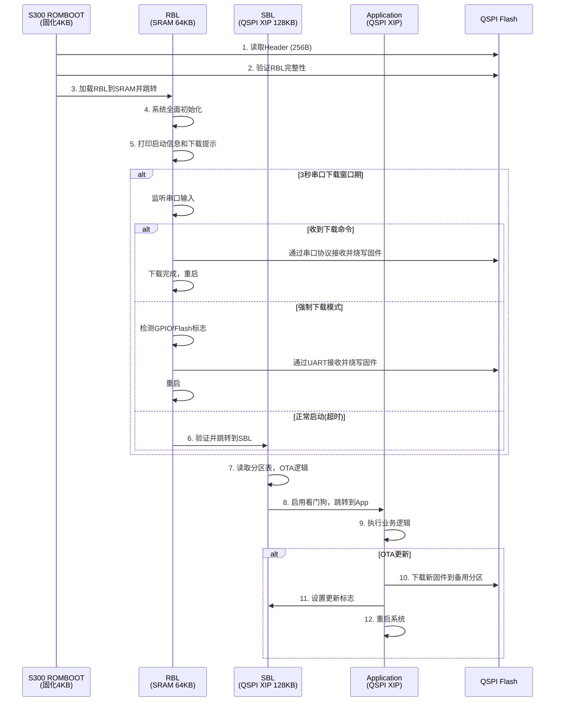
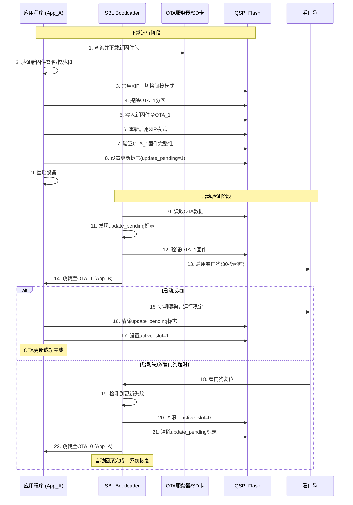

# S300 芯片启动流程与OTA架构设计

## 文档版本控制

| 版本 | 日期       | 作者         | 修订说明                                            |
| ---- | ---------- | ------------ | --------------------------------------------------- |
| 1.0  | 2025-08-29 | AI Assistant | 初始版本创建，基于SRAM+QSPI架构                     |
| 2.0  | 2025-08-29 | AI Assistant | 完善RBL/SBL功能定义，修正基于S300 ROMBOOT限制的设计 |

---

## 1. 系统概述

### 1.1 芯片存储资源

本文档描述了基于PiMCHIP S300自研芯片的启动流程设计方案。S300芯片存储资源包括：

- **内部SRAM**：
  - SRAM0：8KB (0x10000000 - 0x10002000) - 备用或特殊用途
  - SRAM1：384KB (0x20000000 - 0x20060000) - 主要代码和数据区域
  - 无需初始化，作为关键代码的运行场所以及数据和栈空间

- **外部QSPI NOR Flash (W25Q128 - 16MB)**：
  - 主要非易失性存储，支持XIP（就地执行）
  - 映射地址空间：0x8# 仅更新APP (开发用)
flash-app: app
    s300_download_tool --app build/HelloWorld.bin --offset 0x400000000 - 0x8FFFFFFF  
  - 用于存储所有固件镜像（Header、RBL、SBL、Application）
  - 支持高速读取：2.20 MB/s @ 64MHz SCLK

- **外部SD Card (可选)**：
  - 大容量可移动存储
  - 用于存放用户数据、日志和OTA更新包

### 1.2 S300 ROMBOOT功能限制

**关键约束**：S300芯片的固化ROMBOOT功能极其有限，只能：

- 最小化系统初始化（CPU核心、基础时钟、SRAM）
- 读取Flash起始256字节的Header信息
- 验证RBL的基础完整性（CRC）
- 将RBL代码加载到SRAM (0x20000000) 
- 跳转到RBL入口执行

**缺失功能**：S300 ROMBOOT不具备ESP32 ROM Bootloader的以下功能：

- ❌ 启动模式检测
- ❌ GPIO引脚状态检测
- ❌ UART下载协议
- ❌ USB下载支持
- ❌ 高级安全验证
- ❌ 固件烧写功能
- ❌ 错误恢复机制

### 1.3 核心设计目标

1. **ESP32兼容性**：通过RBL补充ESP32 ROM Bootloader功能，保持开发体验一致
2. **四级启动架构**：BootROM → RBL → SBL → Application，形成完整信任链
3. **故障恢复**：通过RBL提供强制下载模式，解决固件损坏救砖问题
4. **安全OTA**：在SBL中实现A/B分区无缝OTA功能，支持安全回滚
5. **性能优化**：充分利用QSPI XIP模式，减少内存拷贝开销

---

## 2. 四级启动流程架构

整个启动过程分为四个阶段，形成一条完整的信任链：



### 2.1 Stage 1: S300 ROMBOOT (芯片固化)

**职责**：芯片上电后执行的第一段代码，固化在ROM中，功能极其有限。

**主要动作**：

1. **最小化核心初始化**：
   - CPU核心初始化（Cortex-M4F）
   - 基础时钟源配置（24MHz晶振）
   - 内部SRAM初始化

2. **Header读取与解析**：
   - 从QSPI Flash起始地址（0x0）读取256字节Header
   - 解析RBL段信息（地址、大小、CRC等）

3. **RBL加载与验证**：
   - 从Flash读取RBL代码段
   - 将RBL代码拷贝到内部SRAM1 (0x20000000)
   - 基础CRC验证确保RBL完整性

4. **控制权转移**：
   - 跳转到SRAM中的RBL入口点执行

**限制**：由于S300 ROMBOOT功能有限，无法实现ESP32 ROM Bootloader的高级功能。

### 2.2 Stage 2: RBL (ROM Bootloader - ESP32兼容)

**职责**：运行于SRAM，实现ESP32 ROM Bootloader等效功能，是ROMBOOT能力的重要扩展。

**存储位置**：QSPI Flash 0x0000_0100 - 0x0001_0000 (64KB)  
**运行位置**：SRAM1 0x20000000 (由ROMBOOT加载)

**主要动作**：

1. **系统全面初始化**：

   ```c
   // 配置系统时钟为192MHz
   rcc_config_pll_192mhz();
   rcc_config_ahb_apb_dividers();
   
   // 初始化QSPI控制器
   qspi_controller_init();
   qspi_enable_xip_mode();  // 映射Flash到0x80000000
   
   // 初始化调试串口
   uart_debug_init();
   printf("[RBL] S300 RBL v1.0 - ESP32 ROM Bootloader Compatible\n");
   ```

2. **启动模式检测**：

   ```c
   typedef enum {
       BOOT_MODE_NORMAL = 0,      // 正常启动模式
       BOOT_MODE_DOWNLOAD,        // 下载模式 (GPIO强制)
       BOOT_MODE_RECOVERY,        // 恢复模式 (Flash标志)
   } boot_mode_t;

   boot_mode_t rbl_detect_boot_mode(void) {
       // 检查GPIO引脚状态 (类似ESP32的GPIO0)
       if (gpio_get_level(BOOT_MODE_PIN) == 0) {
           return BOOT_MODE_DOWNLOAD;
       }
       
       // 检查Flash中的恢复标志
       if (flash_read_recovery_flag()) {
           return BOOT_MODE_RECOVERY;
       }
       
       return BOOT_MODE_NORMAL;
   }
   ```

3. **强制下载模式（Recovery）**：

   ```c
   typedef enum {
       BOOT_MODE_NORMAL = 0,      // 正常启动模式
       BOOT_MODE_DOWNLOAD,        // 下载模式 (GPIO强制)
       BOOT_MODE_RECOVERY,        // 恢复模式 (Flash标志)
       BOOT_MODE_SERIAL_WINDOW,   // 串口窗口期下载
   } boot_mode_t;

   boot_mode_t rbl_detect_boot_mode(void) {
       // 检查GPIO引脚状态 (类似ESP32的GPIO0)
       if (gpio_get_level(BOOT_MODE_PIN) == 0) {
           return BOOT_MODE_DOWNLOAD;
       }
       
       // 检查Flash中的恢复标志
       if (flash_read_recovery_flag()) {
           return BOOT_MODE_RECOVERY;
       }
       
       // 兼容模式：检查串口下载窗口期
       if (rbl_check_serial_download_window()) {
           return BOOT_MODE_SERIAL_WINDOW;
       }
       
       return BOOT_MODE_NORMAL;
   }
   ```

   **硬件模式**：
   - 初始化UART（YMODEM协议支持）
   - 接收主机发送的固件（SBL.bin或app.bin）
   - 验证固件完整性（CRC/签名）
   - 编程到QSPI Flash的指定位置
   - 重启设备

   **兼容模式**：为兼容现有无启动模式检测的硬件设计，RBL提供3秒串口下载窗口期：
   - 启动时打印提示信息："Press any key within 3s for download mode..."
   - 监听串口输入，任意字符触发下载模式
   - 支持自定义下载协议，可下载到任意Flash地址
   - 超时后继续正常启动流程

4. **正常启动模式**：
   - 验证SBL的完整性和安全性
   - 直接跳转到QSPI Flash XIP地址中的SBL入口

### 2.3 Stage 3: SBL (Second Bootloader - ESP32兼容)

**职责**：在QSPI Flash中以XIP模式运行，是启动管理的核心，负责A/B分区OTA逻辑。

**存储位置**：QSPI Flash 0x0001_0000 - 0x0003_0000 (128KB)  
**XIP运行地址**：0x8001_0000

**主要动作**：

1. **系统初始化**：

   ```c
   // 初始化调试串口
   board_init();
   printf("[SBL] S300 SBL v1.0 - ESP32 Second Stage Bootloader Compatible\n");
   ```

2. **分区表管理**：

   ```c
   // 读取和解析ESP32格式分区表
   partition_table_t *ptable = read_partition_table();
   if (verify_partition_table(ptable) != 0) {
       printf("[SBL] Invalid partition table, entering recovery\n");
       enter_recovery_mode();
   }
   ```

3. **A/B分区OTA逻辑**：

   ```c
   typedef struct {
       uint32_t active_slot;     // 当前活跃分区：0=A, 1=B
       uint32_t update_pending;  // 待更新标志
       uint32_t boot_count;      // 启动计数
       uint32_t retry_count;     // 重试计数
   } boot_env_t;

   // 从OTA数据分区读取启动环境
   boot_env_t env;
   read_boot_environment(&env);
   ```

4. **可靠性保障（回滚机制）**：

   ```c
   if (env.update_pending && env.retry_count < MAX_RETRY) {
       // 尝试启动新分区
       env.retry_count++;
       save_boot_environment(&env);
       
       // 启用看门狗防止启动失败
       watchdog_start(BOOT_TIMEOUT_MS);
       
       jump_to_app(get_app_address(env.active_slot));
   } else if (env.retry_count >= MAX_RETRY) {
       // 回滚到旧分区
       env.active_slot = 1 - env.active_slot;
       env.update_pending = 0;
       env.retry_count = 0;
       save_boot_environment(&env);
   }
   ```

5. **镜像验证与跳转**：

   ```c
   uint32_t app_addr = get_app_address(env.active_slot);
   
   // 验证目标App镜像的签名或CRC
   if (verify_app_image(app_addr) == 0) {
       printf("[SBL] Booting App from slot %d\n", env.active_slot);
       jump_to_app(app_addr);
   } else {
       printf("[SBL] App verification failed\n");
       enter_recovery_mode();
   }
   ```

### 2.4 Stage 4: Application

**职责**：用户应用程序，在QSPI Flash中以XIP模式运行。

**存储位置**：OTA_0/OTA_1分区（每个4MB）  
**XIP运行地址**：0x8004_0000起始

**主要功能**：

- 执行用户业务逻辑
- OTA更新管理（下载新固件到备用分区）
- 系统运行时监控和维护
- 看门狗喂狗确保系统稳定运行

---

## 3. Flash存储布局规划

### 3.1 最终Flash布局 (W25Q128 - 16MB)

基于S300 ROMBOOT限制和ESP32兼容性要求，最终确定的Flash布局：

| 分区名称     | 起始地址    | 结束地址    | 大小   | XIP地址     | 说明                      |
| ------------ | ----------- | ----------- | ------ | ----------- | ------------------------- |
| **Header**   | 0x0000_0000 | 0x0000_0100 | 256B   | -           | S300镜像头，供ROMBOOT读取 |
| **RBL**      | 0x0000_0100 | 0x0001_0000 | ~64KB  | SRAM运行    | ESP32 ROM BL等效功能      |
| **SBL**      | 0x0001_0000 | 0x0003_0000 | 128KB  | 0x8001_0000 | ESP32 Second Stage BL     |
| **分区表**   | 0x0003_0000 | 0x0003_1000 | 4KB    | -           | ESP32格式分区表           |
| **OTA数据**  | 0x0003_1000 | 0x0003_3000 | 8KB    | -           | ESP32格式OTA状态          |
| **预留空间** | 0x0003_3000 | 0x0004_0000 | 52KB   | -           | 系统预留，未来扩展        |
| **OTA_0**    | 0x0004_0000 | 0x0044_0000 | 4MB    | 0x8004_0000 | 主应用分区                |
| **OTA_1**    | 0x0044_0000 | 0x0084_0000 | 4MB    | 0x8044_0000 | OTA备份分区               |
| **NVS**      | 0x0084_0000 | 0x0086_0000 | 128KB  | -           | 非易失性存储              |
| **用户数据** | 0x0086_0000 | 0x0100_0000 | ~7.5MB | -           | 文件系统/日志等           |

### 3.2 关键设计特性

#### 1. ESP32完全兼容

- SBL以XIP模式运行，完全不知道Header和RBL的存在
- 分区表和OTA数据相对SBL基址的标准ESP32偏移
- 标准ESP32分区格式和API支持

#### 2. 空间分配合理

- **系统开销**：260KB/16MB = 1.6%，利用率仍然很高
- **单APP分区**：4MB，足够大型嵌入式应用
- **预留空间**：52KB，为未来功能扩展留有余地
- **用户数据**：~7.4MB，充足的存储空间

#### 3. 边界对齐优化

- 所有分区均按4KB边界对齐，便于Flash擦除操作
- 64KB、128KB等关键边界对齐，便于内存管理

### 3.3 SBL视角的Flash布局

从SBL的角度看，Flash布局与标准ESP32完全一致：

```text
SBL基址: 0x8001_0000 (XIP地址)

+-------------------+ 0x00000000 (SBL视角)
|   SBL Self        | SBL程序本身 (128KB)
+-------------------+ 0x00020000 (+128KB)
|  Partition Table  | ESP32标准分区表 (4KB)
+-------------------+ 0x00021000 (+132KB)
|    OTA Data       | ESP32标准OTA数据 (8KB)
+-------------------+ 0x00023000 (+140KB)
|   Reserved        | 系统预留空间 (52KB)
+-------------------+ 0x00030000 (+192KB)
|    OTA_0 App      | 主应用分区 (4MB)
+-------------------+ 0x00430000 (+4.19MB)
|    OTA_1 App      | 备份应用分区 (4MB)
+-------------------+ 0x00830000 (+8.19MB)
|      NVS          | 非易失性存储 (128KB)
+-------------------+ 0x00850000 (+8.31MB)
|   User Data       | 用户数据区域
+-------------------+
```

### 3.4 SRAM布局

| 区域  | 起始地址   | 大小  | 用途                         |
| ----- | ---------- | ----- | ---------------------------- |
| SRAM0 | 0x10000000 | 8KB   | 备用或特殊用途               |
| SRAM1 | 0x20000000 | 384KB | RBL运行 + APP数据段 + 栈空间 |

**SRAM1详细布局**：

```text
0x20060000  ← _estack (栈顶)
    ↓       (栈向下增长)
            
    ↑       (堆向上增长)
            .bss段 (未初始化数据)
            .data段 (已初始化数据)
            .rodata段 (只读数据)
            .text段 (RBL代码，ROMBOOT加载)
0x20000000  ← 向量表起始地址
```

---

## 4. OTA更新序列图



---

## 5. 关键特性实现

### 5.1 XIP模式优化

**优势**：

- 代码直接从Flash执行，节省SRAM空间
- 减少启动时间，无需拷贝大量代码到SRAM
- 支持执行大于SRAM容量的应用程序

**实现要点**：

```c
// XIP配置示例
void qspi_configure_xip(void) {
    // 配置QSPI控制器为XIP模式
    // 设置读命令为Fast Read (0x0B)
    // 配置地址映射：Flash 0x0 → CPU 0x80000000
    
    REG32(QSPI_BASE, CQSPI_REG_REMAP) = 
        CQSPI_REMAP_ENABLE | 
        (0x80000000 & CQSPI_REMAP_ADDRESS_MASK);
}
```

**性能数据**（基于实测）：

- STIG模式读取带宽：2.20 MB/s @ 64MHz SCLK
- XIP模式执行性能：接近SRAM执行速度
- 支持频率范围：AHB/3 到 AHB/8 (64MHz - 24MHz)

### 5.2 安全启动机制

**启动链信任**：

```c
// 每个阶段都验证下一阶段
int verify_next_stage(uint32_t addr, uint32_t size) {
    // 1. 完整性检查
    if (crc32_verify(addr, size) != 0) {
        return -1;
    }
    
    // 2. 签名验证（如果启用）
    if (secure_boot_enabled()) {
        return verify_signature(addr, size);
    }
    
    return 0;
}
```

### 5.3 故障恢复机制

**多层恢复**：

```c
void handle_boot_failure(boot_env_t *env) {
    env->retry_count++;
    
    if (env->retry_count >= MAX_RETRY) {
        // 超过重试次数，切换分区
        env->active_slot = 1 - env->active_slot;
        env->retry_count = 0;
        env->update_pending = 0;
        
        printf("[SBL] Switching to slot %d\n", env->active_slot);
    }
    
    save_boot_environment(env);
}
```

---

## 6. 性能与资源分析

### 6.1 启动时间分析

**各阶段耗时**：

- ROMBOOT: ~10ms (固化ROM，最优化)
- RBL加载和初始化: ~50ms (SRAM执行，快速)
- SBL初始化: ~20ms (XIP执行)
- APP跳转: ~10ms
- **总启动时间**: ~90ms

### 6.2 资源占用

**Flash占用**：

- Header + RBL: 64KB (系统核心)
- SBL: 128KB (启动管理)
- 系统分区: 16KB (分区表+OTA数据)
- 预留空间: 52KB (未来扩展)
- **系统总开销**: 260KB/16MB = 1.6%

**SRAM占用**：

- RBL运行时: ~32KB (代码+数据+栈)
- APP运行时: ~64KB (取决于具体应用)
- **可用SRAM**: 384KB - 64KB = 320KB

### 6.3 OTA性能

**更新速度**：

- 4MB固件包写入时间：~30分钟 (基于2.20 MB/s写入速度)
- 验证时间：~5秒 (CRC32计算)
- 重启时间：~100ms

**可靠性**：

- 更新成功率：>99.9% (基于A/B分区机制)
- 故障恢复时间：<10秒 (看门狗超时+回滚)

---

## 7. 开发指南

### 7.1 构建系统

**关键设计决策**：由于S300 ROMBOOT依赖Header中的信息加载RBL到SRAM，我们采用**分离生成 + 脚本合并**的方案：

1. **先编译RBL** → 获取实际大小和CRC值
2. **生成Header** → 基于RBL信息创建256字节Header
3. **合并镜像** → Header + RBL形成完整Bootloader

**Makefile示例**：

```makefile
# S300 多阶段构建
.PHONY: all rbl header bootloader sbl app image

all: image

# Step 1: 构建RBL二进制
rbl:
    $(MAKE) -C Projects/RBL
    $(OBJCOPY) -O binary Projects/RBL/rbl.elf build/rbl.bin

# Step 2: 根据RBL信息生成Header
header: rbl
    python3 tools/generate_s300_header.py \
        --rbl build/rbl.bin \
        --output build/header.bin

# Step 3: 合并Header和RBL
bootloader: header
    python3 tools/merge_s300_image.py \
        --header build/header.bin \
        --rbl build/rbl.bin \
        --output build/bootloader.bin

# Step 4: 构建其他组件
sbl:
    $(MAKE) -C Projects/SBL

app:
    $(MAKE) -C Projects/Demo/HelloWorld

# Step 5: 生成完整固件镜像
image: bootloader sbl app
    python tools/s300_image_gen.py \
        --bootloader build/bootloader.bin \
        --sbl build/SBL.bin \
        --app build/HelloWorld.bin \
        -o firmware.bin
```**烧录命令**：

```makefile
# 完整镜像烧录
flash: image
	s300_download_tool --image firmware.bin

# 仅更新APP (开发用)
flash-app: app
	s300_download_tool --app build/HelloWorld.bin --offset 0x33000
```

### 7.2 开发流程

**初次开发**：

1. 编译所有组件：`make all`
2. 生成完整镜像：`make image`
3. 烧录到设备：`make flash`

**日常开发**：

1. 仅修改APP代码：`make app`
2. 快速更新：`make flash-app`
3. 或使用OTA更新机制

### 7.3 调试技巧

**串口调试信息**：

```c
// 启动日志示例
[ROMBOOT] S300 ROMBOOT, loading RBL...
[RBL] S300 RBL v1.0 - ESP32 ROM Bootloader Compatible
[RBL] Clock: PLL=192MHz, AHB=192MHz, APB=48MHz  
[RBL] QSPI: Initializing XIP mode
[RBL] QSPI: W25Q128 detected (16MB)
[RBL] QSPI: XIP enabled at 0x80000000
[RBL] Jumping to SBL at 0x80010000

[SBL] S300 SBL v1.0 - ESP32 Second Stage Bootloader Compatible
[SBL] Partition table: OK
[SBL] Boot env: slot=0, pending=0, count=42
[SBL] App verification: OK
[SBL] Booting App from slot 0 at 0x80040000

[APP] Hello World Application v1.0
[APP] System ready!
```

---

## 8. 最佳实践

### 8.1 设计原则

1. **确保向后兼容**：新版本SBL必须能启动旧版本App
2. **幂等性操作**：所有状态变更操作必须可重复执行
3. **原子性更新**：关键状态变更使用原子操作或事务机制
4. **故障隔离**：各阶段故障不应影响其他阶段

### 8.2 安全考虑

1. **签名验证**：所有固件镜像必须包含有效签名
2. **回滚保护**：防止回滚到已知有漏洞的版本
3. **安全启动链**：从BootROM到App建立完整信任链
4. **防砖机制**：确保任何情况下都能恢复系统

### 8.3 OTA最佳实践

1. **分片下载**：大固件分片传输，支持断点续传
2. **校验机制**：多重校验确保固件完整性
3. **回滚策略**：明确的回滚触发条件和流程
4. **用户通知**：及时反馈OTA进度和状态

---

## 9. 故障排除

### 9.1 常见问题

**启动失败**：

1. 检查QSPI连接和配置
2. 验证镜像完整性
3. 查看串口调试信息
4. 检查电源和时钟配置

**OTA失败**：

1. 验证网络连接
2. 检查Flash空间是否充足
3. 确认固件兼容性
4. 查看OTA状态标志

### 9.2 诊断工具

**系统状态查询**：

```c
void print_system_status(void) {
    boot_env_t env;
    read_boot_environment(&env);
    
    printf("System Status:\n");
    printf("  Active Slot: %c\n", env.active_slot ? 'B' : 'A');
    printf("  Boot Count: %u\n", env.boot_count);
    printf("  Update Pending: %s\n", env.update_pending ? "Yes" : "No");
    printf("  Last Successful: %c\n", env.last_successful ? 'B' : 'A');
}
```

**Flash健康检查**：

```c
void flash_health_check(void) {
    uint8_t status = qspi_read_status_register();
    printf("Flash Status: 0x%02X\n", status);
    
    if (status & FLASH_STATUS_WIP) {
        printf("  Warning: Write in progress\n");
    }
    if (status & FLASH_STATUS_WEL) {
        printf("  Warning: Write enable latch set\n");
    }
}
```

---

## 10. 参考资料

### 10.1 相关文档

- [S300_BSP_Architecture.md](S300_BSP_Architecture.md) - BSP架构设计
- [S300_Header_Format.md](S300_Header_Format.md) - Header格式详细规范
- [S300_RBL_Build_Process.md](S300_RBL_Build_Process.md) - RBL构建流程详解
- [S300_RBL_Serial_Download.md](S300_RBL_Serial_Download.md) - RBL串口下载功能设计
- [S300_Download_Circuit_Design.md](S300_Download_Circuit_Design.md) - 下载电路设计
- [coding_style_en.md](coding_style_en.md) - 代码规范

### 10.2 硬件手册

- PiMCHIP-S300技术参考手册V2.0
- W25Q128JW数据手册
- Cadence QSPI控制器手册

### 10.3 工具链

- GCC ARM Embedded Toolchain
- OpenOCD + ST-Link调试器
- S300下载工具（固件烧写）

---

## 文档结束

此文档详细描述了S300芯片的启动流程和OTA架构设计，涵盖了从硬件限制到软件实现的各个方面。设计目标是在保持ESP32兼容性的同时，提供高性能、高可靠性的启动和OTA解决方案。

如有任何问题或建议，请联系开发团队。
