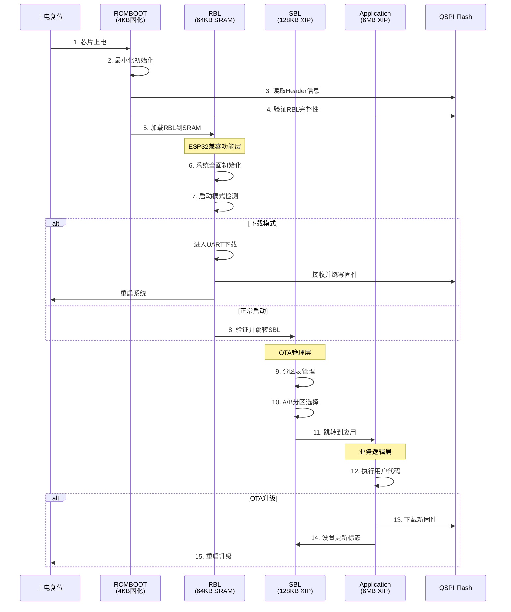
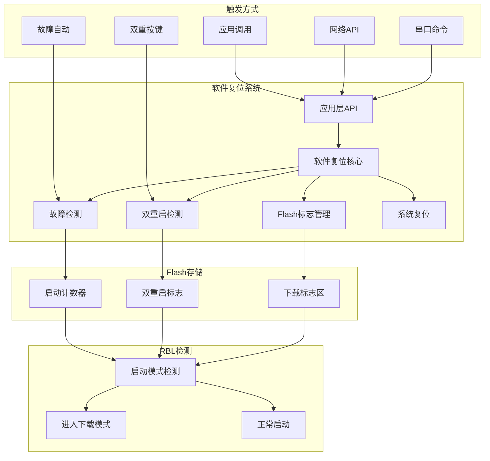

# S300 BSP 完整架构详解

## 🎯 项目概述

S300 BSP（Board Support Package）是为PiMCHIP S300芯片（ARM Cortex-M4）设计的完整系统架构，提供了从底层硬件驱动到高级应用的全栈解决方案。

### 🏗️ 核心设计理念

- **分层架构**: 清晰的5层架构设计
- **CMSIS标准**: 完全遵循ARM CMSIS规范
- **ESP32兼容**: API和开发体验与ESP32保持一致
- **四级启动**: 完整的信任链启动流程
- **软件解决方案**: 软件复位替代硬件复位电路

---

## 📊 系统资源概览

### 🔧 硬件平台

| 组件          | 规格                   | 说明               |
| ------------- | ---------------------- | ------------------ |
| **CPU**       | ARM Cortex-M4 @ 200MHz | 带FPU和DSP指令集   |
| **内部SRAM**  | 392KB (8KB+384KB)      | 高速代码和数据存储 |
| **外部Flash** | 16MB W25Q128 QSPI      | 支持XIP模式执行    |
| **外设接口**  | UART×4, SPI×3, I2C×2   | 丰富的通信接口     |
| **定时器**    | 8个硬件定时器          | 精确时序控制       |
| **DMA**       | 多通道DMA控制器        | 高效数据传输       |

### 💾 内存架构

```text
内存映射布局:

Physical SRAM (392KB):
├── 0x10000000-0x10001FFF → SRAM0 (8KB)    # 特殊用途
└── 0x20000000-0x2005FFFF → SRAM1 (384KB)  # 主运行区域
    ├── 0x20000000-0x2000FFFF → RBL Code (64KB)
    ├── 0x20010000-0x2001FFFF → Stack (64KB)
    └── 0x20020000-0x2005FFFF → Heap/Data (256KB)

QSPI Flash XIP (16MB):
└── 0x80000000-0x80FFFFFF → Flash镜像 (16MB)
    ├── 0x80000000-0x800000FF → Header (256B)
    ├── 0x80000100-0x8000FFFF → RBL (64KB)
    ├── 0x80010000-0x8002FFFF → SBL (128KB)
    ├── 0x80030000-0x8003FFFF → NVS (64KB)
    ├── 0x80040000-0x8063FFFF → OTA_0 (6MB)
    ├── 0x80640000-0x80C3FFFF → OTA_1 (6MB)
    └── 0x80C40000-0x80FFFFFF → Data (3.75MB)
```

---

## 🏗️ 分层架构设计

### Layer 1: CMSIS Core Layer
```text
CMSIS/Core/Include/
├── core_cm4.h              # Cortex-M4核心定义
├── cmsis_gcc.h             # GCC编译器支持
└── cmsis_compiler.h        # 编译器抽象层
```

**职责**:
- ARM标准CMSIS Core接口
- 处理器核心抽象和中断管理
- 标准化的系统控制接口

### Layer 2: Device Layer
```text
CMSIS/Device/PiMCHIP/S300/
├── Include/
│   ├── s300.h              # 主设备头文件
│   ├── system_s300.h       # 系统配置接口
│   └── s300_regs.h         # 寄存器映射定义
└── Source/
    ├── system_s300.c       # 系统初始化实现
    ├── startup_s300.s      # 启动汇编代码
    └── s300_vectors.c      # 中断向量表
```

**职责**:
- S300芯片特定的寄存器定义
- 系统初始化和时钟配置
- 中断向量表和异常处理

### Layer 3: Driver Layer
```text
Drivers/
├── SoC/                    # 片上系统驱动
│   ├── RCC/               # 复位时钟控制
│   ├── GPIO/              # 通用输入输出
│   ├── UART/              # 串行通信
│   ├── QSPI/              # 四线SPI Flash
│   ├── DMA/               # 直接内存访问
│   ├── I2C/               # I2C总线
│   ├── I2S/               # I2S音频
│   └── TIMER/             # 定时器
└── External/              # 外部器件驱动
    ├── W25Qxx/            # W25Q系列Flash
    ├── OV5640/            # OV5640摄像头
    └── WM8978/            # WM8978音频编解码器
```

**职责**:
- 片上外设的底层驱动
- 外部器件的设备驱动
- 统一的HAL接口设计

### Layer 4: Board Layer
```text
Boards/generic_evb/
├── board.h                 # 板级配置定义
├── board.c                 # 板级初始化
├── retarget.c             # printf重定向
└── syscalls.c             # 系统调用实现
```

**职责**:
- 特定板型的配置和初始化
- 引脚映射和外设路由
- 板级功能抽象

### Layer 5: Project Layer
```text
Projects/
├── RBL/                   # ROM Bootloader
├── SBL/                   # Secondary Bootloader
├── HelloWorld/            # 基础示例
├── App_YmodemOTA/         # OTA演示应用
└── Demo/                  # 各种功能演示
    ├── DMA_*/            # DMA演示
    ├── I2S_*/            # I2S音频演示
    ├── QSPI_XIP_Demo/    # QSPI XIP演示
    └── UART_*/           # UART串口演示
```

**职责**:
- 示例程序和演示项目
- 完整的应用解决方案
- 启动引导程序

---

## 🚀 四级启动架构详解

### 启动流程时序图



### Stage 1: ROMBOOT (固化ROM)

**功能极简版引导程序**

```c
// ROMBOOT伪代码 (实际由硅片固化)
void romboot_main(void) {
    // 1. 最小化系统初始化
    cpu_core_init();           // CPU核心初始化
    system_clock_init();       // 系统时钟(HSI 8MHz)
    sram_init();              // SRAM初始化
    qspi_basic_init();        // QSPI基础初始化
    
    // 2. 读取Flash Header
    flash_header_t header;
    qspi_read(0x0, &header, sizeof(header));
    
    // 3. 验证Header魔数
    if (header.magic != 0x504D4348) {  // "PMCH"
        goto error_halt;
    }
    
    // 4. 加载RBL到SRAM
    qspi_read(0x100, (void*)0x20000000, header.rbl_size);
    
    // 5. 验证RBL CRC
    if (crc32_check((void*)0x20000000, header.rbl_size, header.rbl_crc)) {
        goto error_halt;
    }
    
    // 6. 跳转到RBL
    jump_to_address(header.rbl_entry);
    
error_halt:
    while(1) { /* 等待外部复位 */ }
}
```

**关键限制**:
- ❌ 无GPIO启动模式检测
- ❌ 无UART下载协议
- ❌ 无错误恢复机制
- ✅ 仅基础验证和跳转

### Stage 2: RBL (ROM Bootloader)

**ESP32兼容的功能完整引导程序**

```c
// RBL主流程
int rbl_main(void) {
    // 1. 系统全面初始化
    rbl_system_init_complete();
    
    // 2. 启动模式检测
    boot_mode_t mode = rbl_detect_boot_mode_enhanced();
    
    switch (mode) {
        case BOOT_MODE_DOWNLOAD_SOFTWARE:
            return rbl_software_download_mode();
            
        case BOOT_MODE_DOWNLOAD_DOUBLE_RESET:
            return rbl_double_reset_download_mode();
            
        case BOOT_MODE_DOWNLOAD_SERIAL:
            return rbl_serial_download_mode();
            
        case BOOT_MODE_RECOVERY:
            return rbl_recovery_mode();
            
        case BOOT_MODE_NORMAL:
        default:
            return rbl_normal_boot_to_sbl();
    }
}

// 系统全面初始化
int rbl_system_init_complete(void) {
    // 配置高速时钟 200MHz
    rcc_config_pll_200mhz();
    
    // 初始化QSPI控制器
    qspi_controller_init();
    qspi_enable_xip_mode();  // 启用XIP模式
    
    // 初始化调试串口
    uart_debug_init(115200);
    
    // 初始化DMA控制器
    dma_controller_init();
    
    // 初始化GPIO
    gpio_init();
    
    printf("[RBL] S300 ROM Bootloader v2.0 - ESP32 Compatible\n");
    printf("[RBL] CPU: 200MHz, Flash: XIP Mode, SRAM: 384KB\n");
    
    return 0;
}
```

**启动模式检测增强**:

```c
// 增强版启动模式检测
boot_mode_t rbl_detect_boot_mode_enhanced(void) {
    printf("[RBL] Enhanced Boot Mode Detection:\n");
    
    // 1. 软件下载标志 (最高优先级)
    reset_reason_t reason;
    if (software_reset_check_download_flag(&reason)) {
        printf("[RBL] ✓ Software download flag: %s\n", 
               software_reset_get_reason_string(reason));
        return BOOT_MODE_DOWNLOAD_SOFTWARE;
    }
    
    // 2. 双重启检测 (ESP32风格)
    if (software_reset_check_double_reset()) {
        printf("[RBL] ✓ Double reset detected\n");
        return BOOT_MODE_DOWNLOAD_DOUBLE_RESET;
    }
    
    // 3. 启动故障检测
    if (software_reset_check_boot_failure()) {
        printf("[RBL] ✓ Boot failure detected\n");
        return BOOT_MODE_RECOVERY;
    }
    
    // 4. 串口下载窗口 (3秒)
    if (rbl_check_serial_download_window()) {
        printf("[RBL] ✓ Serial download triggered\n");
        return BOOT_MODE_DOWNLOAD_SERIAL;
    }
    
    // 5. GPIO下载引脚
    if (rbl_check_gpio_download_pin()) {
        printf("[RBL] ✓ GPIO download pin detected\n");
        return BOOT_MODE_DOWNLOAD_GPIO;
    }
    
    printf("[RBL] → Normal boot mode\n");
    return BOOT_MODE_NORMAL;
}
```

**UART下载协议**:

```c
// YMODEM兼容下载协议
int rbl_uart_download_protocol(void) {
    printf("[RBL] ========================================\n");
    printf("[RBL] UART Download Mode (YMODEM Compatible)\n");
    printf("[RBL] ========================================\n");
    printf("[RBL] Ready to receive firmware...\n");
    printf("[RBL] Send firmware using YMODEM protocol\n");
    
    // YMODEM接收
    uint32_t received_size = 0;
    uint8_t *firmware_buffer = malloc(MAX_FIRMWARE_SIZE);
    
    int ret = ymodem_receive(firmware_buffer, &received_size);
    if (ret == YMODEM_OK && received_size > 0) {
        printf("[RBL] Received %u bytes\n", received_size);
        
        // 验证固件格式
        if (rbl_verify_firmware_format(firmware_buffer, received_size)) {
            // 烧写到Flash
            ret = rbl_flash_write_firmware(firmware_buffer, received_size);
            if (ret == 0) {
                printf("[RBL] ✓ Firmware download successful!\n");
                printf("[RBL] Rebooting system...\n");
                software_reset_system_now();
            }
        }
    }
    
    printf("[RBL] ✗ Download failed\n");
    free(firmware_buffer);
    return -1;
}
```

### Stage 3: SBL (Secondary Bootloader)

**ESP32兼容的OTA管理器**

```c
// SBL主流程
int sbl_main(void) {
    printf("[SBL] S300 Secondary Bootloader v2.0\n");
    printf("[SBL] ESP32 OTA Compatible\n");
    
    // 1. 读取分区表
    if (sbl_read_partition_table() != 0) {
        return sbl_recovery_mode();
    }
    
    // 2. OTA逻辑处理
    const esp_partition_info_t *boot_partition = sbl_ota_logic();
    if (!boot_partition) {
        return sbl_recovery_mode();
    }
    
    // 3. 验证应用镜像
    if (!sbl_verify_app_image(boot_partition)) {
        return sbl_handle_invalid_app(boot_partition);
    }
    
    // 4. 启动应用程序
    return sbl_boot_application(boot_partition);
}

// OTA分区管理
const esp_partition_info_t* sbl_ota_logic(void) {
    sbl_ota_env_t ota_env;
    
    // 读取OTA环境
    sbl_read_ota_env(&ota_env);
    
    printf("[SBL] OTA Environment:\n");
    printf("[SBL]   Active: ota_%d\n", ota_env.active_partition);
    printf("[SBL]   Pending: %s\n", ota_env.update_pending ? "Yes" : "No");
    printf("[SBL]   Retry: %d/3\n", ota_env.retry_count);
    
    const esp_partition_info_t *partition;
    
    if (ota_env.update_pending && ota_env.retry_count < 3) {
        // 尝试新固件
        partition = sbl_get_update_partition();
        ota_env.retry_count++;
        printf("[SBL] → Trying new firmware (retry %d)\n", ota_env.retry_count);
    } else if (ota_env.retry_count >= 3) {
        // 回滚到稳定版本
        partition = sbl_get_fallback_partition();
        ota_env.update_pending = false;
        ota_env.retry_count = 0;
        ota_env.rollback_count++;
        printf("[SBL] → Rollback to stable firmware\n");
    } else {
        // 正常启动
        partition = sbl_get_active_partition();
        printf("[SBL] → Normal boot\n");
    }
    
    // 更新OTA环境
    sbl_save_ota_env(&ota_env);
    
    return partition;
}
```

### Stage 4: Application

**用户业务逻辑层**

```c
// 应用程序主流程
int main(void) {
    // 1. 应用初始化
    app_system_init();
    
    // 2. 初始化软件复位功能
    app_software_reset_init();
    
    // 3. 向SBL报告启动成功
    sbl_mark_app_valid();
    
    // 4. 启动主业务逻辑
    app_main_task();
    
    return 0;
}

// 应用层软件复位集成
void app_software_reset_init(void) {
    // 初始化软件复位模块
    software_reset_init();
    
    // 注册命令处理器
    app_register_command("reset", app_cmd_reset);
    app_register_command("download", app_cmd_download);
    app_register_command("bootloader", app_cmd_bootloader);
    app_register_command("dfu", app_cmd_dfu);
    app_register_command("status", app_cmd_status);
    
    printf("[APP] Software reset system initialized\n");
}

// 应用层命令处理
int app_cmd_download(int argc, char **argv) {
    printf("[APP] Entering download mode...\n");
    
    // 设置软件下载标志
    software_reset_enter_download_mode(RESET_REASON_USER_CMD);
    
    // 系统复位
    software_reset_system_now();
    
    return 0; // 不会到达这里
}
```

---

## 🔧 软件复位架构 (硬件替代方案)

### 问题背景

S300硬件设计缺少ESP32风格的下载复位电路，无法通过DTR/RTS信号自动进入下载模式。

### 解决方案架构



### Flash标志区设计

**NVS分区布局 (64KB)**:
```
0x00030000-0x0003EFFF: NVS数据区 (60KB)
├── WiFi配置
├── 系统参数
├── 用户配置
└── 证书存储

0x0003F000-0x0003FFFF: 软件复位标志区 (4KB)
├── 0x000-0x017: 下载模式标志 (24字节)
├── 0x100-0x10F: 双重启标志 (16字节)
├── 0x200-0x217: 启动计数器 (24字节)
└── 0x300-0xCFF: 预留扩展 (2.5KB)
```

### 多种触发方式

**1. 串口命令触发**:
```bash
# 发送命令进入下载模式
echo "download" > /dev/ttyUSB0

# 支持的命令
reset      # 普通复位
download   # 进入下载模式
bootloader # 进入bootloader
dfu        # 进入DFU模式
status     # 查看状态
```

**2. 双重启触发**:
```c
// 2秒内连续复位两次
void double_reset_detection(void) {
    uint32_t current_time = get_timestamp();
    uint32_t last_reset_time = read_last_reset_time();
    
    if (current_time - last_reset_time < 2000) {
        // 检测到双重启
        set_download_flag(RESET_REASON_DOUBLE_RESET);
        system_reset();
    }
    
    save_reset_time(current_time);
}
```

**3. 应用API触发**:
```c
// 应用程序内触发下载模式
int app_trigger_download(void) {
    // 设置下载标志
    software_reset_enter_download_mode(RESET_REASON_APP_REQUEST);
    
    // 立即复位
    software_reset_system_now();
    
    return 0;
}
```

**4. 网络API触发**:
```c
// HTTP API触发下载模式
int http_api_download(void) {
    printf("Received remote download request\n");
    
    // 设置下载标志
    software_reset_enter_download_mode(RESET_REASON_REMOTE_CMD);
    
    // 延迟复位，给响应时间
    delay_ms(100);
    software_reset_system_now();
    
    return 0;
}
```

**5. 故障自动触发**:
```c
// 连续启动失败自动进入恢复模式
void boot_failure_detection(void) {
    uint32_t failure_count = read_failure_count();
    
    if (failure_count >= 3) {
        printf("Boot failure detected, entering recovery\n");
        set_download_flag(RESET_REASON_BOOT_FAILURE);
        clear_failure_count();
        system_reset();
    }
}
```

---

## 🛠️ 驱动架构详解

### SoC驱动架构

**统一HAL接口设计**:

```c
// 统一的驱动接口标准
typedef struct {
    int (*init)(void *config);
    int (*deinit)(void);
    int (*read)(void *buffer, size_t size);
    int (*write)(const void *buffer, size_t size);
    int (*ioctl)(uint32_t cmd, void *arg);
} driver_ops_t;

// UART驱动示例
typedef struct {
    driver_ops_t ops;           // 通用操作接口
    uint32_t base_addr;         // 基地址
    uint32_t baudrate;          // 波特率
    uart_config_t config;       // 配置参数
    ring_buffer_t rx_buffer;    // 接收缓冲区
    ring_buffer_t tx_buffer;    // 发送缓冲区
    dma_channel_t dma_rx;       // DMA接收通道
    dma_channel_t dma_tx;       // DMA发送通道
} uart_driver_t;
```

**GPIO驱动架构**:

```c
// GPIO配置结构
typedef struct {
    uint32_t pin;               // 引脚号
    gpio_mode_t mode;           // 输入/输出模式
    gpio_pull_t pull;           // 上拉/下拉
    gpio_speed_t speed;         // 输出速度
    gpio_af_t alternate;        // 复用功能
} gpio_config_t;

// GPIO驱动API
int gpio_init(uint32_t pin, const gpio_config_t *config);
int gpio_deinit(uint32_t pin);
int gpio_set_level(uint32_t pin, uint32_t level);
int gpio_get_level(uint32_t pin);
int gpio_set_interrupt(uint32_t pin, gpio_int_type_t type, gpio_isr_t handler);
```

**QSPI驱动架构**:

```c
// QSPI配置
typedef struct {
    uint32_t clock_speed;       // 时钟频率
    qspi_mode_t mode;          // 工作模式
    qspi_flash_size_t size;    // Flash大小
    bool xip_enable;           // XIP模式使能
} qspi_config_t;

// QSPI驱动API
int qspi_init(const qspi_config_t *config);
int qspi_read(uint32_t addr, void *buffer, size_t size);
int qspi_write(uint32_t addr, const void *buffer, size_t size);
int qspi_erase_sector(uint32_t addr);
int qspi_enable_xip(void);
int qspi_disable_xip(void);
```

### DMA驱动架构

```c
// DMA传输配置
typedef struct {
    dma_channel_t channel;      // DMA通道
    uint32_t src_addr;         // 源地址
    uint32_t dst_addr;         // 目标地址
    uint32_t size;             // 传输大小
    dma_width_t width;         // 传输位宽
    dma_mode_t mode;           // 传输模式
    dma_callback_t callback;   // 完成回调
} dma_config_t;

// DMA驱动API
int dma_init(void);
int dma_request_channel(dma_channel_t *channel);
int dma_release_channel(dma_channel_t channel);
int dma_start_transfer(const dma_config_t *config);
int dma_stop_transfer(dma_channel_t channel);
bool dma_is_transfer_complete(dma_channel_t channel);
```

---

## 🎯 开发工具链架构

### 构建系统

**Makefile架构**:

```makefile
# 顶层Makefile
PROJECT := S300_BSP
TARGET := $(PROJECT)

# 工具链配置
TOOLCHAIN_PREFIX := arm-none-eabi-
CC := $(TOOLCHAIN_PREFIX)gcc
AS := $(TOOLCHAIN_PREFIX)as
LD := $(TOOLCHAIN_PREFIX)ld
OBJCOPY := $(TOOLCHAIN_PREFIX)objcopy
OBJDUMP := $(TOOLCHAIN_PREFIX)objdump

# 编译参数
CFLAGS := -mcpu=cortex-m4 -mthumb -mfloat-abi=hard -mfpu=fpv4-sp-d16
CFLAGS += -Os -g3 -Wall -Wextra
CFLAGS += -ffunction-sections -fdata-sections

# 链接参数
LDFLAGS := -T$(LDSCRIPT) -Wl,--gc-sections -Wl,--print-memory-usage

# 包含路径
INCLUDES := -I CMSIS/Core/Include
INCLUDES += -I CMSIS/Device/PiMCHIP/S300/Include
INCLUDES += -I Drivers/SoC/RCC/Include
INCLUDES += -I Drivers/SoC/GPIO/Include
# ... 其他包含路径

# 源文件
SOURCES := $(wildcard CMSIS/Device/PiMCHIP/S300/Source/*.c)
SOURCES += $(wildcard Drivers/SoC/*/*.c)
SOURCES += $(wildcard Boards/generic_evb/*.c)
# ... 其他源文件

# 构建目标
all: $(TARGET).elf $(TARGET).bin $(TARGET).hex

$(TARGET).elf: $(OBJECTS)
	$(CC) $(LDFLAGS) -o $@ $^

$(TARGET).bin: $(TARGET).elf
	$(OBJCOPY) -O binary $< $@

$(TARGET).hex: $(TARGET).elf
	$(OBJCOPY) -O ihex $< $@
```

### 调试支持

**OpenOCD配置**:

```tcl
# S300 OpenOCD配置
source [find interface/stlink.cfg]
source [find target/stm32f4x.cfg]  # S300兼容STM32F4

# S300特定配置
set CHIPNAME s300
set CPUTAPID 0x4ba00477

# Flash配置
set FLASH_SIZE 0x1000000  # 16MB外部Flash
flash bank external_flash qspi 0x80000000 $FLASH_SIZE 0 0 $CHIPNAME.cpu

# 调试配置
init
reset init
```

**GDB调试脚本**:

```gdb
# S300 GDB初始化脚本
target extended-remote :3333

# 加载符号
file build/S300_BSP.elf

# 设置断点
break main
break HardFault_Handler

# QSPI Flash操作命令
define flash_erase
    monitor flash erase_sector external_flash $arg0 $arg1
end

define flash_write
    monitor flash write_image $arg0 $arg1
end

# 启动调试
load
monitor reset init
continue
```

### Python工具链

**现代包管理 (uv)**:

```toml
# pyproject.toml
[project]
name = "s300-tools"
version = "1.0.0"
description = "S300 BSP Development Tools"
requires-python = ">=3.8"

dependencies = [
    "pyserial>=3.5",
    "rich>=13.0",
    "click>=8.0",
    "pyyaml>=6.0",
    "requests>=2.28",
]

[project.optional-dependencies]
dev = [
    "black>=23.0",
    "mypy>=1.0",
    "pytest>=7.0",
    "pytest-cov>=4.0",
]

[project.scripts]
s300-reset = "s300_tools.reset_tool:main"
s300-ota = "s300_tools.ota_tool:main"
s300-flash = "s300_tools.flash_tool:main"

[build-system]
requires = ["hatchling"]
build-backend = "hatchling.build"

[tool.black]
line-length = 88
target-version = ["py38"]

[tool.mypy]
python_version = "3.8"
strict = true
```

**安装脚本**:

```bash
#!/bin/bash
# install.sh - Linux/macOS安装脚本

echo "Installing S300 BSP Tools..."

# 检查uv是否安装
if ! command -v uv &> /dev/null; then
    echo "Installing uv package manager..."
    curl -LsSf https://astral.sh/uv/install.sh | sh
    source ~/.bashrc
fi

# 安装工具
cd "$(dirname "$0")"
uv pip install -e .

# 验证安装
if command -v s300-reset &> /dev/null; then
    echo "✓ S300 tools installed successfully!"
    s300-reset --version
else
    echo "✗ Installation failed"
    exit 1
fi
```

```powershell
# install.ps1 - Windows安装脚本
Write-Host "Installing S300 BSP Tools..." -ForegroundColor Green

# 检查Scoop是否安装
if (!(Get-Command scoop -ErrorAction SilentlyContinue)) {
    Write-Host "Installing Scoop package manager..." -ForegroundColor Yellow
    Set-ExecutionPolicy RemoteSigned -Scope CurrentUser
    Invoke-RestMethod get.scoop.sh | Invoke-Expression
}

# 安装Python和uv
scoop bucket add main
scoop install python
scoop install uv

# 安装工具
Push-Location $PSScriptRoot
uv pip install -e .

# 验证安装
if (Get-Command s300-reset -ErrorAction SilentlyContinue) {
    Write-Host "✓ S300 tools installed successfully!" -ForegroundColor Green
    s300-reset --version
} else {
    Write-Host "✗ Installation failed" -ForegroundColor Red
    exit 1
}
```

---

## 📈 性能特性

### 启动性能

| 阶段           | 时间       | 主要操作             |
| -------------- | ---------- | -------------------- |
| **ROMBOOT**    | ~10ms      | 最小化初始化+RBL加载 |
| **RBL**        | ~50ms      | 系统初始化+模式检测  |
| **SBL**        | ~20ms      | 分区管理+应用验证    |
| **APP启动**    | ~100ms     | 应用初始化           |
| **总启动时间** | **~180ms** | 从上电到应用运行     |

### 内存使用

| 组件         | SRAM使用 | Flash使用 | 说明                  |
| ------------ | -------- | --------- | --------------------- |
| **RBL**      | 64KB     | 64KB      | 运行时全部加载到SRAM  |
| **SBL**      | 8KB      | 128KB     | XIP模式，最小SRAM占用 |
| **应用**     | 256KB    | 6MB       | 用户可用空间          |
| **系统保留** | 64KB     | 320KB     | 堆栈和系统数据        |

### QSPI性能

| 模式         | 读取速度 | 写入速度 | 说明     |
| ------------ | -------- | -------- | -------- |
| **标准SPI**  | 10MB/s   | 0.5MB/s  | 兼容模式 |
| **QSPI模式** | 40MB/s   | 2MB/s    | 四线并行 |
| **XIP模式**  | 35MB/s   | N/A      | 就地执行 |

---

## 🎉 总结

S300 BSP架构提供了一个完整、专业的嵌入式系统解决方案：

### ✅ 核心优势

1. **🏗️ 分层清晰**: 5层架构设计，职责明确，易于维护
2. **🚀 启动可靠**: 四级启动流程，完整信任链，故障恢复
3. **🔧 软件创新**: 软件复位完全替代硬件复位电路
4. **📱 ESP32兼容**: API和开发体验与ESP32保持一致
5. **🛠️ 工具完善**: 现代Python工具链，支持uv/scoop
6. **⚡ 性能优化**: QSPI XIP模式，180ms快速启动

### 🎯 适用场景

- **🏭 工业控制**: 可靠的启动机制和故障恢复
- **🏠 智能家居**: ESP32兼容API，快速移植
- **📡 物联网设备**: OTA升级和远程管理
- **🎵 音视频产品**: I2S音频和摄像头支持
- **🔬 原型开发**: 丰富的演示项目和开发工具

这个架构不仅解决了S300芯片的硬件限制，还提供了比传统方案更加灵活和强大的功能，为嵌入式系统开发提供了一个现代化的解决方案。
