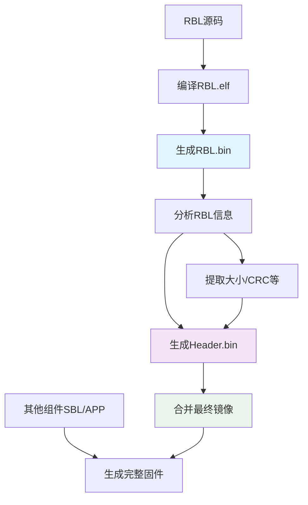

# S300 RBL + Header 构建流程设计

## 1. 构建流程概述



## 2. 详细实现方案

### 2.1 构建步骤

#### Step 1: 编译RBL
```makefile
# RBL Makefile
RBL_SOURCES = rbl_main.c rbl_uart.c rbl_flash.c rbl_boot.c
RBL_LDSCRIPT = rbl.ld

rbl.elf: $(RBL_SOURCES)
	$(CC) $(CFLAGS) -T $(RBL_LDSCRIPT) -o $@ $^

rbl.bin: rbl.elf
	$(OBJCOPY) -O binary $< $@
	@echo "RBL binary size: $$(stat -c%s rbl.bin) bytes"
```

#### Step 2: 生成Header脚本
```python
#!/usr/bin/env python3
# tools/generate_s300_header.py

import struct
import zlib
import argparse
from pathlib import Path

class S300Header:
    def __init__(self):
        self.header = bytearray(256)  # 256字节Header
        
    def calculate_crc32(self, data):
        """计算CRC32校验值"""
        return zlib.crc32(data) & 0xffffffff
        
    def set_cortex_m4_info(self, flash_addr, exe_addr, length, check_val):
        """设置Cortex-M4(控制系统)段信息"""
        # Pro字段 (0x00): XIP模式 + CRC32校验
        pro = 0x00000001  # CRC32校验 + XIP模式
        struct.pack_into('<I', self.header, 0x00, pro)
        
        # Addr字段 (0x04): Flash地址
        struct.pack_into('<I', self.header, 0x04, flash_addr)
        
        # Exe Addr字段 (0x08): 执行地址
        struct.pack_into('<I', self.header, 0x08, exe_addr)
        
        # Len字段 (0x0C): 长度
        struct.pack_into('<I', self.header, 0x0C, length)
        
        # Check字段 (0x10): 校验值
        struct.pack_into('<I', self.header, 0x10, check_val)
        
    def set_rbl_info(self, rbl_path):
        """根据RBL文件设置Header信息"""
        rbl_data = Path(rbl_path).read_bytes()
        rbl_size = len(rbl_data)
        rbl_crc = self.calculate_crc32(rbl_data)
        
        # RBL作为控制系统段处理
        flash_addr = 0x100      # RBL在Flash中的起始地址
        exe_addr = 0x20000000   # RBL在SRAM中的执行地址
        
        self.set_cortex_m4_info(flash_addr, exe_addr, rbl_size, rbl_crc)
        
        print(f"RBL Info:")
        print(f"  Size: {rbl_size} bytes")
        print(f"  CRC32: 0x{rbl_crc:08X}")
        print(f"  Flash Addr: 0x{flash_addr:08X}")
        print(f"  Exec Addr: 0x{exe_addr:08X}")
        
    def set_default_segments(self):
        """设置其他段的默认信息"""
        # Cortex-M0段 - 暂时设为无效
        struct.pack_into('<I', self.header, 0x20, 0x00000000)  # Pro: 无操作
        
        # CPT段 - 暂时设为无效  
        struct.pack_into('<I', self.header, 0x40, 0x00000000)  # Pro: 无操作
        
        # Other段 - 暂时设为无效
        struct.pack_into('<I', self.header, 0xD0, 0x00000000)  # Addr: 无效
        
    def calculate_header_crc(self):
        """计算并设置Header CRC32"""
        # 计算前252字节的CRC32
        header_data = self.header[:252]
        header_crc = self.calculate_crc32(header_data)
        
        # 将CRC32写入最后4字节
        struct.pack_into('<I', self.header, 252, header_crc)
        
        print(f"Header CRC32: 0x{header_crc:08X}")
        
    def generate(self, rbl_path, output_path):
        """生成完整Header"""
        print("Generating S300 Header...")
        
        # 设置RBL信息
        self.set_rbl_info(rbl_path)
        
        # 设置其他段信息
        self.set_default_segments()
        
        # 计算Header CRC
        self.calculate_header_crc()
        
        # 写入文件
        Path(output_path).write_bytes(self.header)
        print(f"Header saved to: {output_path}")

def main():
    parser = argparse.ArgumentParser(description='Generate S300 Header')
    parser.add_argument('--rbl', required=True, help='RBL binary file')
    parser.add_argument('--output', required=True, help='Output header file')
    
    args = parser.parse_args()
    
    header = S300Header()
    header.generate(args.rbl, args.output)

if __name__ == '__main__':
    main()
```

#### Step 3: 镜像合并脚本
```python
#!/usr/bin/env python3
# tools/merge_s300_image.py

import argparse
from pathlib import Path

def merge_image(header_path, rbl_path, output_path):
    """合并Header和RBL生成最终镜像"""
    print("Merging S300 image...")
    
    # 读取Header (256字节)
    header_data = Path(header_path).read_bytes()
    if len(header_data) != 256:
        raise ValueError(f"Header size must be 256 bytes, got {len(header_data)}")
    
    # 读取RBL
    rbl_data = Path(rbl_path).read_bytes()
    rbl_size = len(rbl_data)
    
    # 合并数据
    image_data = header_data + rbl_data
    
    # 写入输出文件
    Path(output_path).write_bytes(image_data)
    
    print(f"Image merged successfully:")
    print(f"  Header: 256 bytes")
    print(f"  RBL: {rbl_size} bytes") 
    print(f"  Total: {len(image_data)} bytes")
    print(f"  Output: {output_path}")

def main():
    parser = argparse.ArgumentParser(description='Merge S300 Header and RBL')
    parser.add_argument('--header', required=True, help='Header binary file')
    parser.add_argument('--rbl', required=True, help='RBL binary file')
    parser.add_argument('--output', required=True, help='Output image file')
    
    args = parser.parse_args()
    
    merge_image(args.header, args.rbl, args.output)

if __name__ == '__main__':
    main()
```

### 2.2 Makefile集成

```makefile
# S300 完整构建系统

# 工具路径
TOOLS_DIR = tools
HEADER_GEN = $(TOOLS_DIR)/generate_s300_header.py
IMAGE_MERGE = $(TOOLS_DIR)/merge_s300_image.py

# 构建目标
BUILD_DIR = build
RBL_BIN = $(BUILD_DIR)/rbl.bin
HEADER_BIN = $(BUILD_DIR)/header.bin
BOOTLOADER_BIN = $(BUILD_DIR)/bootloader.bin

.PHONY: all rbl header bootloader clean

all: bootloader

# 构建RBL
rbl: $(RBL_BIN)

$(RBL_BIN): rbl.elf
	@mkdir -p $(BUILD_DIR)
	$(OBJCOPY) -O binary $< $@
	@echo "RBL binary generated: $@"

# 生成Header
header: $(HEADER_BIN)

$(HEADER_BIN): $(RBL_BIN)
	@mkdir -p $(BUILD_DIR)
	python3 $(HEADER_GEN) --rbl $(RBL_BIN) --output $@
	@echo "Header generated: $@"

# 合并最终Bootloader镜像
bootloader: $(BOOTLOADER_BIN)

$(BOOTLOADER_BIN): $(HEADER_BIN) $(RBL_BIN)
	python3 $(IMAGE_MERGE) --header $(HEADER_BIN) --rbl $(RBL_BIN) --output $@
	@echo "Bootloader image ready: $@"

# 验证镜像
verify: $(BOOTLOADER_BIN)
	@echo "Verifying bootloader image..."
	@echo "Total size: $$(stat -c%s $(BOOTLOADER_BIN)) bytes"
	@echo "Header (first 256 bytes):"
	@hexdump -C $(BOOTLOADER_BIN) | head -16
	@echo "RBL starts at offset 0x100:"
	@hexdump -C -s 256 -n 64 $(BOOTLOADER_BIN)

clean:
	rm -rf $(BUILD_DIR)

# 快速重建
rebuild: clean all
```

## 3. 优势分析

### 3.1 分离生成的优势

1. **信息依赖正确**：Header基于实际RBL信息生成，确保准确性
2. **构建流程清晰**：每个步骤职责明确，易于调试
3. **版本控制友好**：可以独立跟踪RBL和Header的变更
4. **工具链灵活**：支持不同的RBL配置和Header生成策略

### 3.2 脚本化的优势

1. **自动化程度高**：一次配置，重复使用
2. **错误检查完善**：可以校验文件大小、CRC等
3. **跨平台兼容**：Python脚本在不同系统上都能运行
4. **易于扩展**：后续可以支持更多段信息

## 4. 使用示例

```bash
# 完整构建流程
make all

# 分步构建
make rbl          # 只构建RBL
make header       # 生成Header 
make bootloader   # 合并最终镜像

# 验证结果
make verify

# 单独使用工具
python3 tools/generate_s300_header.py --rbl build/rbl.bin --output build/header.bin
python3 tools/merge_s300_image.py --header build/header.bin --rbl build/rbl.bin --output build/bootloader.bin
```

## 5. 注意事项

### 5.1 构建顺序
- 必须先构建RBL，再生成Header
- Header依赖RBL的实际大小和校验值

### 5.2 地址配置
- RBL Flash地址：0x100 (跳过256字节Header)
- RBL SRAM地址：0x20000000 (SRAM1起始)
- 执行地址必须与链接脚本一致

### 5.3 校验验证
- 构建完成后使用hexdump验证Header格式
- 确保RBL可以被ROMBOOT正确加载和执行

这种方案确保了构建流程的可靠性和可维护性，同时满足S300 ROMBOOT的设计要求。
