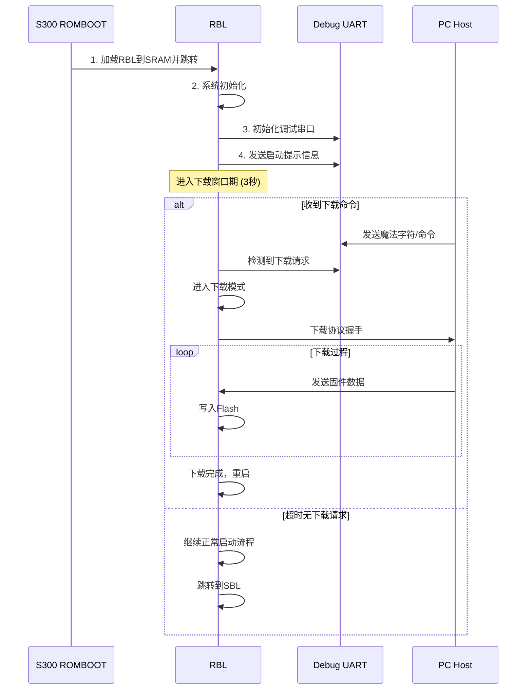

# S300 RBL串口下载功能设计

## 1. 功能概述

为了兼容现有没有启动模式检测电路的硬件设计，RBL在启动时提供一个**串口下载窗口期**，在此期间监听串口命令，如果检测到下载协议则进入下载模式，否则继续正常启动流程。

## 2. 设计方案

### 2.1 启动时序



### 2.2 核心参数配置

```c
// RBL下载窗口配置
#define RBL_DOWNLOAD_TIMEOUT_MS     3000    // 3秒超时
#define RBL_DOWNLOAD_MAGIC_WORD     0x5A5A  // 魔法字符
#define RBL_DOWNLOAD_BAUDRATE       115200  // 波特率
#define RBL_DOWNLOAD_UART_PORT      3       // UART3端口

// 下载协议定义
#define CMD_DOWNLOAD_START         0x01
#define CMD_DOWNLOAD_DATA          0x02  
#define CMD_DOWNLOAD_END           0x03
#define CMD_ERASE_FLASH           0x04
#define CMD_GET_INFO              0x05
```

## 3. 实现细节

### 3.1 RBL主流程

```c
// rbl_main.c
#include "rbl_uart.h"
#include "rbl_download.h"
#include "rbl_flash.h"

int main(void)
{
    // 1. 基础系统初始化
    rbl_system_init();
    
    // 2. 初始化调试串口
    rbl_uart_init(RBL_DOWNLOAD_UART_PORT, RBL_DOWNLOAD_BAUDRATE);
    
    // 3. 发送启动信息
    rbl_print_banner();
    
    // 4. 检查下载窗口
    if (rbl_check_download_window()) {
        // 进入下载模式
        rbl_download_mode();
        // 下载完成后重启
        rbl_system_reset();
    }
    
    // 5. 正常启动流程
    rbl_normal_boot();
    
    return 0;
}

void rbl_print_banner(void)
{
    printf("\r\n");
    printf("========================================\r\n");
    printf("S300 RBL v1.0 - ROM Bootloader\r\n");
    printf("Build: %s %s\r\n", __DATE__, __TIME__);
    printf("========================================\r\n");
    printf("Press any key within 3s for download mode...\r\n");
}
```

### 3.2 下载窗口检测

```c
// rbl_download.c
#include "rbl_timer.h"
#include "rbl_uart.h"

bool rbl_check_download_window(void)
{
    uint32_t start_time = rbl_get_tick_ms();
    uint8_t rx_data;
    
    printf("Download window: ");
    
    while ((rbl_get_tick_ms() - start_time) < RBL_DOWNLOAD_TIMEOUT_MS) {
        // 检查串口是否有数据
        if (rbl_uart_read_nonblock(&rx_data, 1) > 0) {
            printf("\r\nDownload request detected!\r\n");
            return true;
        }
        
        // 每500ms打印一个点
        static uint32_t last_dot = 0;
        if ((rbl_get_tick_ms() - last_dot) >= 500) {
            printf(".");
            last_dot = rbl_get_tick_ms();
        }
        
        // 让出CPU，避免死循环
        rbl_delay_ms(10);
    }
    
    printf("\r\nTimeout, continuing normal boot...\r\n");
    return false;
}
```

### 3.3 下载协议实现

```c
// rbl_download_protocol.c

typedef struct {
    uint8_t  cmd;           // 命令类型
    uint8_t  seq;           // 序列号
    uint16_t len;           // 数据长度
    uint32_t addr;          // 目标地址
    uint8_t  data[];        // 数据内容
} download_packet_t;

typedef struct {
    uint8_t  status;        // 状态码
    uint8_t  seq;           // 应答序列号
    uint16_t len;           // 应答数据长度
    uint8_t  data[];        // 应答数据
} download_response_t;

void rbl_download_mode(void)
{
    printf("Entering download mode...\r\n");
    printf("Ready to receive firmware\r\n");
    
    download_packet_t packet;
    download_response_t response;
    uint8_t seq_num = 0;
    
    while (1) {
        // 接收下载包
        if (rbl_receive_packet(&packet) != 0) {
            continue;
        }
        
        // 处理命令
        switch (packet.cmd) {
            case CMD_GET_INFO:
                rbl_handle_get_info(&packet, &response);
                break;
                
            case CMD_ERASE_FLASH:
                rbl_handle_erase_flash(&packet, &response);
                break;
                
            case CMD_DOWNLOAD_START:
                rbl_handle_download_start(&packet, &response);
                break;
                
            case CMD_DOWNLOAD_DATA:
                rbl_handle_download_data(&packet, &response);
                break;
                
            case CMD_DOWNLOAD_END:
                rbl_handle_download_end(&packet, &response);
                return; // 下载完成，退出
                
            default:
                rbl_send_error_response(packet.seq, "Unknown command");
                continue;
        }
        
        // 发送应答
        rbl_send_response(&response);
    }
}

int rbl_handle_get_info(download_packet_t *packet, download_response_t *response)
{
    typedef struct {
        uint32_t chip_id;
        uint32_t flash_size;
        uint32_t sram_size;
        char     version[16];
    } chip_info_t;
    
    chip_info_t info = {
        .chip_id = 0x5300,
        .flash_size = 16 * 1024 * 1024,  // 16MB
        .sram_size = 384 * 1024,         // 384KB
    };
    strcpy(info.version, "S300-RBL-1.0");
    
    response->status = 0x00;  // 成功
    response->seq = packet->seq;
    response->len = sizeof(chip_info_t);
    memcpy(response->data, &info, sizeof(chip_info_t));
    
    printf("Sent chip info to host\r\n");
    return 0;
}

int rbl_handle_download_data(download_packet_t *packet, download_response_t *response)
{
    // 写入Flash
    int ret = qspi_flash_write(packet->addr, packet->data, packet->len);
    
    response->status = (ret == 0) ? 0x00 : 0xFF;
    response->seq = packet->seq;
    response->len = 0;
    
    if (ret == 0) {
        printf("Written %d bytes to 0x%08X\r\n", packet->len, packet->addr);
    } else {
        printf("Write failed at 0x%08X\r\n", packet->addr);
    }
    
    return ret;
}
```

### 3.4 超时和错误处理

```c
// rbl_download_timeout.c

#define PACKET_TIMEOUT_MS       5000    // 包接收超时
#define MAX_RETRY_COUNT         3       // 最大重试次数

int rbl_receive_packet(download_packet_t *packet)
{
    uint32_t start_time = rbl_get_tick_ms();
    uint8_t *buffer = (uint8_t *)packet;
    int received = 0;
    int expected = sizeof(download_packet_t);
    
    while ((rbl_get_tick_ms() - start_time) < PACKET_TIMEOUT_MS) {
        int len = rbl_uart_read_timeout(buffer + received, 
                                      expected - received, 100);
        if (len > 0) {
            received += len;
            
            // 检查是否接收完整
            if (received >= 4) {  // 至少有包头
                expected = sizeof(download_packet_t) + packet->len;
                if (received >= expected) {
                    // 验证校验和
                    if (rbl_verify_packet_checksum(packet)) {
                        return 0;  // 成功
                    } else {
                        printf("Checksum error\r\n");
                        return -1;
                    }
                }
            }
        }
    }
    
    printf("Packet receive timeout\r\n");
    return -1;
}
```

## 4. 兼容性特性

### 4.1 自动波特率检测

```c
// 支持多种波特率自动检测
static const uint32_t supported_baudrates[] = {
    115200, 57600, 38400, 19200, 9600
};

bool rbl_auto_detect_baudrate(void)
{
    for (int i = 0; i < sizeof(supported_baudrates)/sizeof(uint32_t); i++) {
        rbl_uart_set_baudrate(supported_baudrates[i]);
        
        // 发送测试字符并等待回显
        rbl_uart_write("AT\r\n", 4);
        
        uint8_t response[10];
        if (rbl_uart_read_timeout(response, sizeof(response), 500) > 0) {
            printf("Baudrate detected: %d\r\n", supported_baudrates[i]);
            return true;
        }
    }
    
    // 恢复默认波特率
    rbl_uart_set_baudrate(RBL_DOWNLOAD_BAUDRATE);
    return false;
}
```

### 4.2 多种触发方式

```c
// 支持多种下载触发方式
typedef enum {
    TRIGGER_ANY_CHAR = 0,       // 任意字符触发
    TRIGGER_MAGIC_WORD,         // 魔法字符触发  
    TRIGGER_BREAK_SIGNAL,       // BREAK信号触发
    TRIGGER_AT_COMMAND,         // AT命令触发
} download_trigger_t;

bool rbl_check_download_trigger(download_trigger_t trigger_type)
{
    switch (trigger_type) {
        case TRIGGER_ANY_CHAR:
            return rbl_uart_data_available();
            
        case TRIGGER_MAGIC_WORD:
            return rbl_check_magic_word();
            
        case TRIGGER_BREAK_SIGNAL:
            return rbl_check_break_signal();
            
        case TRIGGER_AT_COMMAND:
            return rbl_check_at_command();
            
        default:
            return false;
    }
}
```

## 5. 配置选项

### 5.1 编译时配置

```c
// rbl_config.h
#ifndef RBL_CONFIG_H
#define RBL_CONFIG_H

// 下载功能配置
#define RBL_ENABLE_DOWNLOAD         1       // 启用下载功能
#define RBL_DOWNLOAD_WINDOW_MS      3000    // 下载窗口时间
#define RBL_DOWNLOAD_UART_PORT      3       // 串口端口
#define RBL_DOWNLOAD_BAUDRATE       115200  // 默认波特率
#define RBL_AUTO_BAUDRATE_DETECT    1       // 自动波特率检测

// 触发方式配置
#define RBL_DOWNLOAD_TRIGGER        TRIGGER_ANY_CHAR

// 协议配置
#define RBL_MAX_PACKET_SIZE         1024    // 最大包大小
#define RBL_PACKET_TIMEOUT_MS       5000    // 包超时
#define RBL_MAX_RETRY_COUNT         3       // 最大重试

// 调试配置
#define RBL_DEBUG_ENABLED           1       // 调试输出
#define RBL_VERBOSE_DOWNLOAD        1       // 详细下载信息

#endif // RBL_CONFIG_H
```

### 5.2 运行时配置

```c
// 支持通过环境变量或Flash配置下载参数
typedef struct {
    uint32_t window_timeout_ms;
    uint32_t baudrate;
    uint8_t  uart_port;
    uint8_t  trigger_type;
    uint8_t  enable_auto_baudrate;
} rbl_download_config_t;

// 从Flash读取配置
int rbl_load_download_config(rbl_download_config_t *config)
{
    // 尝试从Flash配置区域读取
    if (qspi_flash_read(CONFIG_FLASH_ADDR, config, sizeof(*config)) == 0) {
        // 验证配置有效性
        if (config->window_timeout_ms > 0 && 
            config->window_timeout_ms <= 10000) {
            return 0;
        }
    }
    
    // 使用默认配置
    config->window_timeout_ms = RBL_DOWNLOAD_WINDOW_MS;
    config->baudrate = RBL_DOWNLOAD_BAUDRATE;
    config->uart_port = RBL_DOWNLOAD_UART_PORT;
    config->trigger_type = RBL_DOWNLOAD_TRIGGER;
    config->enable_auto_baudrate = RBL_AUTO_BAUDRATE_DETECT;
    
    return -1;
}
```

## 6. 主机端工具

### 6.1 Python下载工具

```python
#!/usr/bin/env python3
# tools/s300_download.py

import serial
import time
import struct
import argparse
from pathlib import Path

class S300Downloader:
    def __init__(self, port, baudrate=115200):
        self.ser = serial.Serial(port, baudrate, timeout=1)
        self.seq = 0
        
    def connect(self):
        """连接并触发下载模式"""
        print("Triggering download mode...")
        
        # 发送任意字符触发下载模式
        self.ser.write(b'\r\n')
        time.sleep(0.1)
        
        # 等待下载模式提示
        for _ in range(50):  # 5秒超时
            if self.ser.in_waiting:
                response = self.ser.read(self.ser.in_waiting)
                if b"download mode" in response.lower():
                    print("Download mode activated!")
                    return True
            time.sleep(0.1)
            
        return False
        
    def get_chip_info(self):
        """获取芯片信息"""
        packet = struct.pack('<BBHI', 0x05, self.seq, 0, 0)
        self.ser.write(packet)
        
        response = self.ser.read(8)
        if len(response) >= 4:
            status, seq, length = struct.unpack('<BBH', response[:4])
            if status == 0 and length > 0:
                data = self.ser.read(length)
                chip_id, flash_size, sram_size = struct.unpack('<III', data[:12])
                version = data[12:28].decode('ascii').rstrip('\x00')
                
                print(f"Chip ID: 0x{chip_id:04X}")
                print(f"Flash Size: {flash_size // (1024*1024)}MB")
                print(f"SRAM Size: {sram_size // 1024}KB")
                print(f"Version: {version}")
                return True
        return False
        
    def download_file(self, filename, address):
        """下载文件到Flash"""
        data = Path(filename).read_bytes()
        total_size = len(data)
        
        print(f"Downloading {filename} to 0x{address:08X} ({total_size} bytes)")
        
        # 分块下载
        chunk_size = 1024
        offset = 0
        
        while offset < total_size:
            chunk = data[offset:offset + chunk_size]
            target_addr = address + offset
            
            # 发送数据包
            packet = struct.pack('<BBHI', 0x02, self.seq, len(chunk), target_addr)
            packet += chunk
            
            self.ser.write(packet)
            
            # 等待应答
            response = self.ser.read(4)
            if len(response) >= 2:
                status, seq = struct.unpack('<BB', response[:2])
                if status == 0:
                    offset += len(chunk)
                    progress = (offset * 100) // total_size
                    print(f"\rProgress: {progress}%", end='', flush=True)
                else:
                    print(f"\nDownload failed at offset 0x{offset:X}")
                    return False
            else:
                print(f"\nNo response at offset 0x{offset:X}")
                return False
                
            self.seq = (self.seq + 1) & 0xFF
            
        print("\nDownload completed successfully!")
        return True

def main():
    parser = argparse.ArgumentParser(description='S300 Download Tool')
    parser.add_argument('--port', required=True, help='Serial port')
    parser.add_argument('--baudrate', type=int, default=115200, help='Baudrate')
    parser.add_argument('--file', required=True, help='Firmware file')
    parser.add_argument('--addr', type=lambda x: int(x, 0), default=0x10000, 
                        help='Target address')
    
    args = parser.parse_args()
    
    downloader = S300Downloader(args.port, args.baudrate)
    
    if downloader.connect():
        downloader.get_chip_info()
        downloader.download_file(args.file, args.addr)
    else:
        print("Failed to enter download mode")

if __name__ == '__main__':
    main()
```

## 7. 使用示例

### 7.1 正常启动日志

```
========================================
S300 RBL v1.0 - ROM Bootloader
Build: Aug 29 2025 15:30:45
========================================
Press any key within 3s for download mode...
Download window: ...
Timeout, continuing normal boot...
[RBL] Jumping to SBL at 0x80010000
```

### 7.2 下载模式日志

```
========================================
S300 RBL v1.0 - ROM Bootloader  
Build: Aug 29 2025 15:30:45
========================================
Press any key within 3s for download mode...
Download window: .
Download request detected!
Entering download mode...
Ready to receive firmware
Sent chip info to host
Written 1024 bytes to 0x00010000
Written 1024 bytes to 0x00010400
...
Download completed, restarting...
```

### 7.3 主机端使用

```bash
# 下载SBL固件
python3 tools/s300_download.py --port COM3 --file sbl.bin --addr 0x10000

# 下载应用固件  
python3 tools/s300_download.py --port COM3 --file app.bin --addr 0x40000
```

## 8. 总结

这个串口下载功能设计具有以下特点：

✅ **兼容性好**：支持现有无启动模式检测的硬件
✅ **用户友好**：3秒窗口期，操作简单
✅ **功能完整**：支持固件下载、擦除、信息查询
✅ **鲁棒性强**：超时处理、错误重试、校验机制
✅ **可配置性**：支持多种触发方式和参数配置
✅ **调试便利**：详细的调试输出和状态反馈

这个方案既保证了新硬件的高级功能，又兼容了现有硬件的使用需求。
